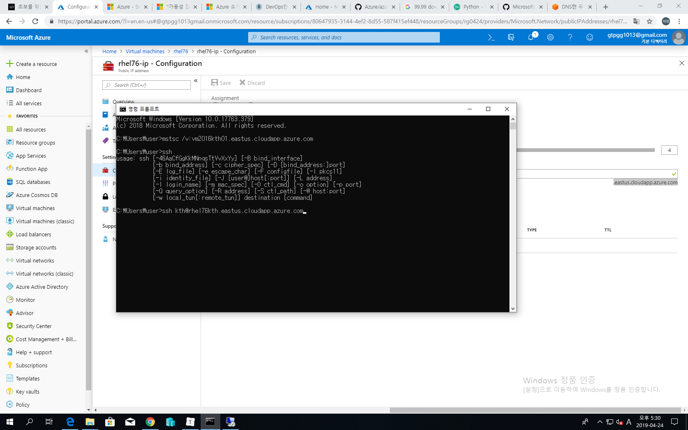

# 2019/04/24

## MS Azure lec #2

- Host : 네트워크의 장치 (컴퓨터, 프린터, 라우터, 스위치)

  - 라우터 : 네트워크의 바운더리를 만들어주는 장비 (외부 네트워크와 소통 위해 얘를 통해 패킷이 들어오고 나감) ==> 이때 사용하는 게 Gateway IP 주소

  - Gateway 주소 안쓰면 네트웍 내부와는 통신이 잘 되나 외부와는 패킷 교류 X

    - 70.12.113.1 / 보통 xxx.xxx.xxx.1 or 254

      

- On-premise : 우리 회사 기업 네트웍

- Cloud : 네트웍 / 인터넷을 통한 서비스

- Resource(in cloud) : Server / storage / Network 장비

- Azure management models
  - Classic(Azure Service Management) : 초창기
    - 여러개의 서비스가 grouping된 모델
    - 확장하기가 어렵다
  - ARM(Azure Resource Manager)
    - 서비스(Resource)를 쪼개서 관리 : microservice
    - 서비스 별도 관리 : 연동성이 좋다
    - Resource group은 관리 범위 (권한의 바운더리)
      - 그룹별로 서비스 관리
    - supports tagging : tagging : 각각의 Resource에 속성을 부여
      - ex) '인사부'라는 tagging이 되어있는 Resource만 가져와서 정보를 분석함
    - template-based 배포 : ARM template => json 형식으로 구현되어있음
      - template를 통해 복잡한 설계들을 error 적게 간단히 만들 수 있다
      - enterprise환경 바로 설계 및 배포 가능
    - RBAC(Role-Based Access Control) : 어떠한 그룹에 각종 권한을 부여하여 특정 계정에게 주면, 그 계정이 각 Resource 및 서비스를 사용할 수 있음
- Resource
  - cloud 에서는 HW 그자체
  - Azure에서는 서비스 하나하나
- In portal :
  - 서비스 : Azure에서 준비해놓은 100여가지 서비스
  - 리소스 : 내가 만든 것 (사용하려)

- Azure portal / Azure Account Center
- subscription이 있어야만 Service를 이용할 수 있다!
  - Pay-As-You-go : 개인이 얼마 내고 그만큼 쓰기
  - Microsoft reseller : 영업사원 할인
  - Enterprise Agreement (EA) : 기업차원 대량구매
  - Azure Hybrid Benefit
  - Azure Reserved VM Instance : 대량의 계산량, 자원 필요할때 남들이 안쓸때 쓰겠다 : 할인
- Azure Management Tools
  - Azure PowerShell / CLI : 대량으로 관리할 때 사용 : local에서
  - Azure Cloud Shell : 포탈에서 PowerShell이나 CLI 명령어 지원 : cloud에서
  - VS with Azure SDKs : VS에서 추가 설치하면 관리 가능
  - Azure Security Center : 보안
  - Azure Advisor : 알림
  - Azure Monitor : 모니터링

- 새 VM 생성
  - 
  - pw : Pa55w.rd!!!!
  - 방화벽 RDP 오픈 (3389 Port)
  - auto-shutdown 설정 (off)
  - 
  - public IP / private IP (VM 생성 순서대로 4,5,6...)
  - public으로 접속하면 private로 connect해줌 (IP forwarding)
  - 
  - 생성 후 connect 버튼을 통해 VM에 접속할 수 있음! (RDP 파일을 다운받아 원격접속)
  - Linux 만들기
  - 
  - Linux는 SSH로 접속 ==> putty로 하면 됨

- 3장 :  VM in Microsoft Azure

  - Azure 쓸때 차이점
    - Hyper-V 1 Gen만 가능
    - whdx 지원 X
    - 고정 디스크(fixed disk)만 지원
      - 가상 디스크 타입 (VM이 사용하는 디스크 : vhd, vhdx, vhds)
        - 고정 디스크 : 80GB로 만들 경우 80GB : 실제 서비스 : 만들자마자 80기가 할당
        - 동적 확장 : 80GB로 만들 경우 4MB-->80GB : test/개발용도 : 필요하면 용량 더 할당
        - 차이점 보관용 : Base에서 변경된 내용만 저장 : test/개발용도
    - Read-only VM 만들 수 있다
  - VM 사용되지 않고 있으면 과금되지 않음 (deallocating)
  - Configuring VM availability
    - Azure VMs in an availability zone
      - 다른 데이터 센터로 복제하는 것(데이터 보호)
      - 99.99%(four-nine) availability SLA : 약 1년에 52분 down-time 허용
    - Azure VMs in an availability set : 99.95% : Data Center에서 Lack단위 중복 저장 (3개의 **Rack**에 분산 저장해서 한쪽이 먹통되도 다른쪽에서 쓸 수 있도록!)
      - 데이터 센터 내의 다른 Rack으로 복제하는 것
      - 
      - 3 fault domain : 1개의 Rack이 fault domain
      - up to 20 update domain : 서버 패치 후 reboot해야 함(이때 서버 중지) ==> 그 때 다른 Rack에 있는 VM이 작동한다
      - 다른 서버가 아님 : Rack 단위
      - 
    - Standalone zone : 99.9%

  - virtual machine 설정
    - size : resize 가능
    - Networking : 99%가 inbound rules
      - priority 숫자가 낮을수록 우선순위를 가짐
      - 
      - 80번(http)포트 / 22번(ssh)포트로 들어오는 것을 허용하는 방화벽 설정
  - Configuring Azure VM storage
    - overview
      - 
      - D 드라이브에 데이터 저장하면 다 날라감 (저장 ㄴㄴ)
      - C에 저장 고고 or 하드 드라이브 attach 후 저장

- 추가 정보

  - account.azure.com : 구독 정보 확인 사이트

  - DNS

    - 이름 풀이 서비스(FQDN(전체 컴퓨터 이름) ==> IP Address) : 영문 이름을 IP로! <114>

      - 호스트이름 + 도메인 이름
      - www.naver.com ==>  125.209.222.141
      - www가 호스트 이름 / naver.com가 도메인 이름
      - <WS 원격 접속>
      - 
      - .eastus.cloudapp.azure.com <== 요게 전체 도메인 이름
      - vm2016kth01 <== 요게 호스트 네임 (내가 정의함)
      - vm2016kth01.eastus.cloudapp.azure.com ==> 이 전체가 공인 IP(40.121.92.117)로 연결
      - 원래는 그냥 IP로 접근해도 잘 됨
      - <ssh 이용 linux 원격 제어>

      - 
      - exit 하면 빠져나올 수 있음

    - 서비스의 위치를 알려주는 서비스 (SRV 레코드)  <네비게이션>

      - 

  

  - SLA : Service Level Agreement
  - 패킷 : 시작점 IP / 도착점 IP 포함 : 영문으로는 패킷이 못 지나가기 때문에 DNS 통해 IP로 바꿔줘!
  - 교육과정
    - 20979F
      https://github.com/MicrosoftLearning/10979-Introduction-to-Azure-for-IT-Professionals
    - 20533E
      https://github.com/MicrosoftLearning/20533-ImplementingMicrosoftAzureInfrastructureSolutions/tree/master/Instructions