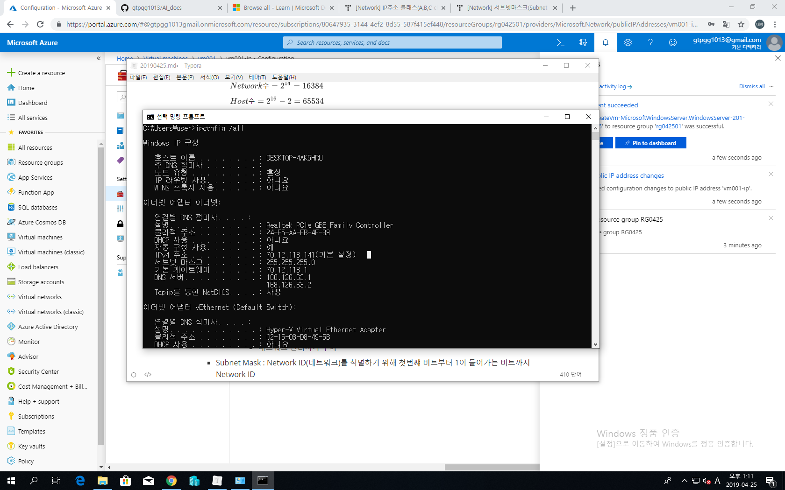
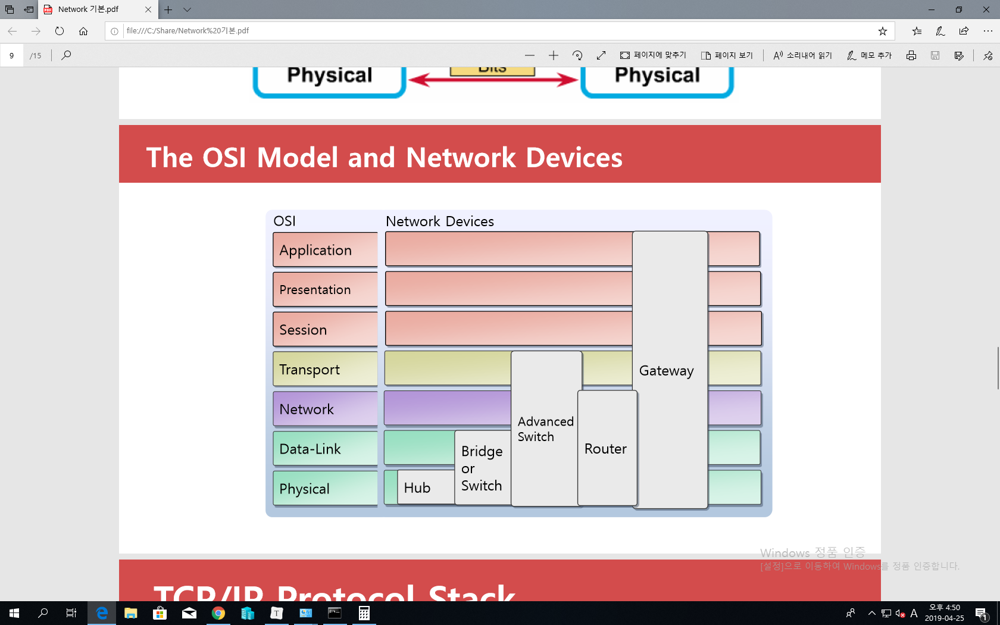

# 2019/04/25

# MS Azure lec #3

- ## 5장 : Introduction to Azure Networking

  - 선수강과목 : CCNA

  - 선수지식 : Network 기초

    - What is Network? LAN

      - Peer to Peer : 소규모 컴퓨터 공유
      - Client / Server : 서버는 서비스 제공자, 클라는 사용자
      - 

    - ##### IP Address : 인터넷의 주소 체계 : v4 ($32bit=2^{32}=42억9천개$)  요게 부족해서 / v6 (128bit)로 업그레이드 중 : 340 언데실리온($10^{36}$)

      - Public IP : 라우팅 되는 IP (공유기의 IP)

      - Private IP : 라우팅 되지 않는 IP (공유기에서 각자로 향하는 사설 IP)

        - 보안 : 외부 공격이 사설 IP는 찾아갈 수가 없다
        - NAT : 공인 IP <=> 사설 IP : 라우터를 통하면 들어오고 나가며 주소가 변환됨(사->공/공->사) Network Address Translation : 적은 공인 IP로 많은 컴퓨터를 인터넷 사용할 때

      - 0 : 네트워크 식별

      - 127 : loop back IP, 자신의 시스템에 구현된 IP, test

      - A Class : 0으로 시작 : 00000000 00000000 00000000 00000000 (1.0.0.0) ~ 

        01111111 1111111 1111111 1111111 (126.255.255.255) // 범위 : 0, 127은 특수용도

        32비트를 8개씩 나눔(옥텟) ==> 4옥텟 : 1옥텟 = 8bit

        N.H.H.H (N=network / H=host) / SM = 255.0.0.0

        $Network 수 = 2^7-2 = 126   (0, 127 빼고)$

        $Host 수 = 2^{24}-2 = 16,777,214  (Host ID의 모든 비트가 0 or 모든 비트가 1일때는 IP 세팅 X)$

        - 세팅하지 않는 IP
          - Host ID의 모든 비트가 0일때 : Network를 식별
          - Host ID의 모든 비트가 1일때 : BroadCast 데이터 전송시 사용

      - B Class : 10으로 시작 : 10000000 00000000 00000000 00000000 (128.0.0.0) ~ 

        10111111 1111111 1111111 1111111 (191.255.255.255)

        N.N.H.H / 255.255.0.0

        $Network 수 = 2^{14} = 16384$

        $Host 수 = 2^{16} - 2 = 65534$ 

      - C Class : 110으로 시작 : 11000000 00000000 00000000 00000000 (192.0.0.0) ~ 

        11011111 1111111 1111111 1111111 (223.255.255.255)

        N.N.N.H / 255.255.255.0

        $Network 수 = 2^{21} = 2097152$

        $Host 수 = 2^8-2 = 254 $

      - 여기까지 주소용으로 사용하는 IP

      =============================================================================

      - D Class 1110 : 멀티캐스트 데이터 전송 (1: 그룹 통신)
      - E Class 1110 : 군사용 / 예약 IP
      - 
        - 근데 왜 이 컴퓨터는 A class 인데 subnet mask가 255.255.255.0 이니?
          - A class 하나당 1400만개 호스팅 할 수 있다 : 기업 하나한테 주면 낭비가 너무 심함 --> 다른 방식 사용 : CIDR
      - IP Address = 
        - Network ID : 네트워크를 식별 (우편번호) : 라우터 이걸로 찾고
          - ISP(인터넷 서비스 업체 : KT / SKT 등등)에서 부여
            - ISP가 IANA에서 IP 대역폭을 구입
        - Host ID : 네트워크내의 시스템을 식별 (번지) : 실제 컴퓨터(시스템)
          - 네트워크 관리자가 부여

    - ##### Subnet Mask : Network ID(네트워크)를 식별하기 위해 첫번쨰 비트부터 1이 들어가는 비트까지 Network ID

    - ##### Gateway IP : 라우터 장비에 부여되는 IP, 내부 네트워크와 외부 네트워크의 관문

      - IP와 Subnet Mask를 AND연산하여 Network ID를 식별하고 목적지 IP와 자신의 Subnet Mask를 AND 연산하여 목적지 Network ID를 식별 => AND(bit연산)
      - 두 Network ID가 동일할 경우 Gateway없이 통신하고, 다를 경우 패킷을 Gateway에 전송

    - ##### CIDR 표기법

      - (10.0.0.0/24) < == CIDR 표기법

      - CIDR : Subnet Mask를 10진법으로 표기하지 않고 2진법으로 표기 / Class는 IP낭비가 심함. 10진법 표기

        - 우리회사는 50개의 IP가 필요합니다 : 6bit만 있으면 = 64 : 충분하다!

        - 그래서 맨 뒤에서부터 6개만 Host ID로 보고, 나머지 26개는 Network ID로 봄

        - ip/26 <= subnet mask 1 비트수 (CIDR)

        - ip/255.255.255.192

        - 11111111 11111111 11111111 11000000 ==> 62개 ip 사용가능

          - 연습문제 : 300개 ip 필요, 최적의 subnet mask CIDR 표기법?

            - ip/23
            - ip/255.255.254.0

            - 연습문제 2 : ip 2000개? ==> ip/21, ip/255.255.248.0

    - ##### Sub Network 

      - 기존 네트웍 잘라서 쓰기 : Subnetting

      - 클래스로 자르면 너무 비효율적이기 때문에 Host 영역을 더 늘려서 사용해보겠다!

        

      - ISP에서 70.12.113.0/24 를 부여받았다. 2개의 네트워크를 분할해서 사용 (라우터 사용)

        - 70.12.113.00000000 ==> 70.12.113.0/25 <== 요 25가 subnet mask!

          - Network ID : 70.12.113.0 (host에 전부 0)
          - Broadcast IP : 70.12.113.127 (host에 전부 1)
          - Host 수 : $2^7 -2 =126$
          - IP 범위 : 70.12.113.1 ~ 70.12.113.126

        - 70.12.113.10000000 ==> 70.12.113.128/25

          - Network ID : 70.12.113.128

          - Broadcast IP : 70.12.113.255

          - Host 수 :  $2^7 -2 =126$

          - IP 범위 : 70.12.113.129 ~ 70.12.113.254

            

      - ISP에서 70.12.0.0/16 을 부여받았다. 4개의 네트워크를 분할해서 사용 (라우터 사용)

        - 70.12.00000000.00000000 ==> 70.12.0.0/18

          - Network ID : 70.12.00000000.00000000 => 70.12.0.0
          - Broadcast IP : 70.12.00111111.11111111 => 70.12.63.255
          - Host 수 : $2^{14} -2 =16382$
          - IP 범위 : 70.12.0.1 ~ 70.12.63.254

        - 70.12.01000000.00000000 ==> 70.12.64.0/18

          - Network ID : 70.12.64.0 
          - Broadcast IP : 70.12.01111111.11111111 => 70.12.127.255
          - Host 수 : $2^{14} -2 =16382$
          - IP 범위 : 70.12.64.1 ~ 70.12.127.254

        - 70.12.10000000.00000000 ==> 70.12.128.0/18

          - Network ID : 70.12.128.0 
          - Broadcast IP : 70.12.10111111.11111111 => 70.12.191.255
          - Host 수 : $2^{14} -2 =16382$
          - IP 범위 : 70.12.128.1 ~ 70.12.191.254

        - 70.12.11000000.00000000 ==> 70.12.192.0/18

          - Network ID : 70.12.192.0

          - Broadcast IP : 70.12.11111111.11111111 => 70.12.255.255

          - Host 수 : $2^{14} -2 =16382$

          - IP 범위 : 70.12.192.1 ~ 70.12.255.254

            

    - ##### OSI 7 Layer

      - 프로토콜을 개발하는 하나의 표준을 정의한 것
      - 예전에는 각 회사들이 다른 사의 제품들과는 통신이 안되서 통일시킴

    - ##### Encapsulation

      - 네트워크에서 소통할 수 있는 크기로 잘게 쪼개서 보냄
      - Application : 사용자 (Data)
      - Presentation : 압축, 암호 (Data)
      - Session (Data)
      - Transport : 잘개 쪼갬 (Segments)
      - Network : Header(보낸사람, 받는사람) 추가 (Packets) - router는 여기 있음
      - Data Link : Header(검증 파일 등) 추가 (Frames)
      - Physical : 랜카드(데이터 신호를 전기 신호로) / HBA카드(데이터 신호를 광신호로) (Bits)
      - 
      - 각 layer에 따라 L1,2,3,4 등의 장비로 나눔

    - ##### De-Encapsulation

      - 각 요소 역순으로 재조합 (헤더 확인 후 제거 및 재조립)

    - ##### Network 장비 (라우터, 스위치, 허브)

      - Router
        - 네트워크의 바운더리 설정
        - Router에 연결된 Port에 subnet mask를 조절함으로서(회사의 Network관리자가) 네트워크의 크기를 조절할 수 있다.
        - Router는 직접 연결되지 않은 Network에 대해서는 스스로 알 수는 없고, 라우팅 프로토콜 혹은 관리자를 통해서 알아야 한다(Private IP 알 수 없다 / 보안)
      - Switch
        - 정보를 일단 받아들인 다음 읽어서 해당되는 포트에만 정보를 줌 
      - Hub
        - 허브가 네트워크에서 허브에 물려있는 모든 컴퓨터로 일단 데이터를 뿌려줌 ==> 그 후 각 컴퓨터에서 각 랜카드가 정보를 수용할 지 말지 결정(자기가 타깃이 아닌경우 드랍)

    - ##### Port

      - 데이터가 전송되는 통로 (0 ~ 65,536)

      - 잘 알려진 포트(well-known) : 0~1023

        - TCP : 신뢰성 있는 전송, 3way Handshake, 전송속도가 느림
          - 3way Handshake : 패킷 전송 후 3번 확인함
        - UDP : 신뢰성 없는 전송, 전송속도가 빠름 : 실시간 동영상 서비스

      - C:\Windows\system32\drivers\etc\services

        - 잘 알려진 포트들 설명

      - TCP 21 : FTP

      - TCP 22 : SSH

      - TCP 23 : Telenet

      - TCP 25 : SMTP

      - TCP 53 : DNS 영역전송 : 1차 DNS의 DB를 2차 DNS의 DB로 복제하는 것

      - UDP 53 : DNS 이름풀이 : Host FQDN을 IP로 변환시키기

      - UDP 67,68 : DHCP

      - TCP 80 : HTTP

      - TCP 1433 : MS-SQL

      - TCP 3389 : RDP

        

      - wf.msc(고급 방화벽), firewall.cpl(기본 방화벽)

        - 방화벽 : inbound control : 들어오는 포트의 control

    - ##### NAT

      - 패킷의 Source IP ==> Public IP로 변환해서 인터넷 망으로 전달

    - ##### VPN

    - ##### DNS

      

- ### 추가 지식

  - ipconfig /flushdns
  - C:\Windows\System32\drivers\etc ==> hosts라는 파일이 메모리로 load되게 됨
  - 데이터 전송 방식
    - 유니캐스트(1:1)
    - 멀티캐스트(1:그룹) : 하나의 시스템에서 데이터를 여러명에게 전송
    - 브로드캐스트(1:모든(라우터에서 필터)) : 네트워크 안에 있는 모든 컴퓨터에게 데이터 전송
      - 목적지주소에 브로드캐스트 IP가 들어감
  - 라우터 : 네트웍을 분리시켜주는 장비
  - IANA : Internet Assigned Numbers Authority
  - ISP : Internet Service Provider
  - netstat -na : 현재 네트워크 상태 표시
  - tracert www.google.com : google까지 가는 중간에 걸치는 router들 보여줌

