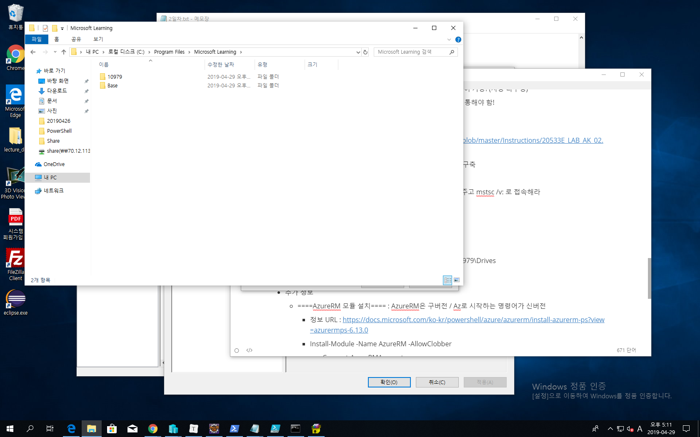
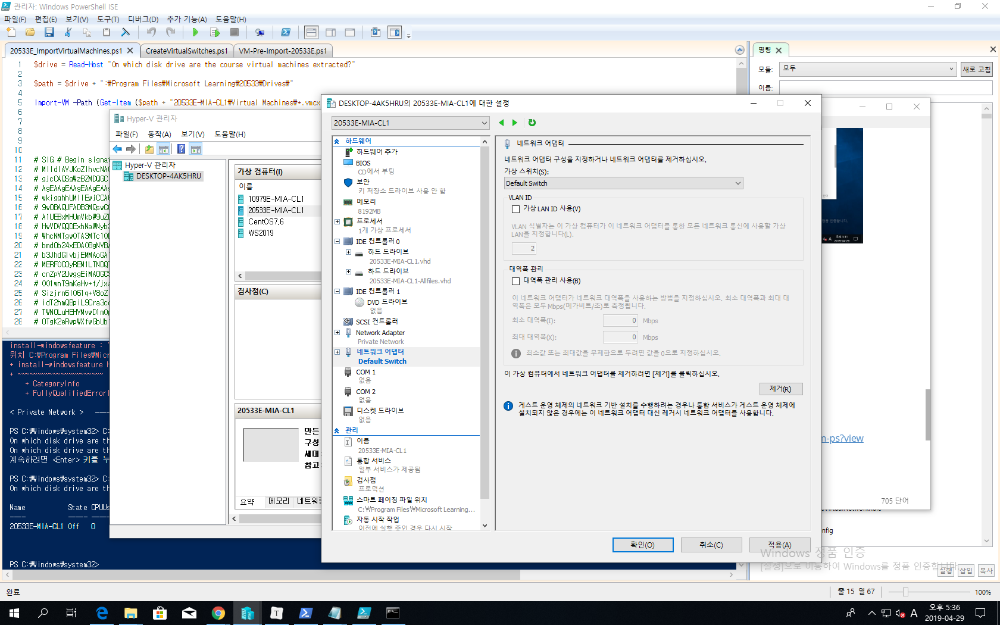

# 2019/04/29

# MS Azure lec #5

- 복습

  - Azure Network
    - TCP / UDP / ICMP (ping을 보낼때 사용)
    - 방화벽 Setting시 : NSG(Azure 방화벽 서비스) / VM 자체 방화벽 2개 다 Setting 해야 함!
    - Azure는 기본적으로 DNS 이름을 제공하나, customization 가능 : Azure Zone 서비스 이용
      - domain 이름까지만 만듬 : host 네임은 record로 생성 : 이전에 Domain을 신청해야!
      - Azure DNS 서비스 : PaaS : OS / DNS 서버는 설치되어 있음, 
        - 원래 DNS 서비스 수행하려면 서버 위에 OS 설치 / DNS 서버 구축 / Zone 생성 : 그리고 이걸 2번 이상 반복해야 함 : 왜냐하면 DNS 서버가 너무 중요하기 때문에 1차 / 2차 / 3차 서버 등으로 복사해야 함! : 패치까지 해야해서 자원 낭비
        - Azure는 알아서 4차 서버까지 구성해줌 : 1/2/3/4차
      - IaaS 환경에서도 서비스 가능함 : VM 올리고 관리까지 실사용자가 함
    - VNet : 10.10.0.0/16
      - VNet 생성시 최소 1개의 Subnet 구성해야 함
        - 원래 Subnet은 Router라는 장비가 필요(물리적인 환경에서)
          - but Azure에서는 이미 각 서브넷의 1번이 자동 라우터로 설정되어있음(Gateway IP)
            - 자동 라우팅
          - VNet 안의 서브넷들은 라우터 없이 통신 가능
          - 필요하다면 라우터 커스터마이징 할 수 있음
        - Subnet 1 : 10.10.0.0/24
        - Subnet 2 : 10.10.1.0/24 ...
        - 요런 Subnet들이 각각 Web / App / SQL 등 다양한 서버들로 분할 사용됨
        - 안쪽 VM들은 보통 사설 IP 사용
          - 10.0.0.0 – 10.255.255.255
          - 172.16.00 – 172.31.255.255
          - 192.168.0.0. – 192.168.255.255 
      - VNet & Azure resources
        - Resources that require virtual networks include
          - Azure VMs
          - VM scale sets : 사용률에 따라 유동적으로 VM수 조정
          - Azure Application Gateway (Internal) : **L7의 Application 단에서 수행되는 PaaS  로드 밸런싱 서비스**
        - Resources that support VNets
          - Point-to-site VPN
          - Service Endpoint : 서비스 할 때는 문제없음 (PaaS 서비스) : but 사용자가 이 서비스에 직접 접근하여 관리할 때 VNet 필요
      - Azure Load Balancer : L4단에서 사용되는 백엔드 풀(VMs)까지 설정하는 LB
        - LB rules : 어떤 프로토콜에 대해서 분산처리 해줄지
        - probes : 현상 체크
      - VPN :  원격 컴퓨터를 터널링 기술을 통해 네트워크 안으로 집어넣어 주는 것
        - VNet peering : 같은 데이터 내의 서버들 grouping

- 명령어 : 대량작업에 능함

  - 스크립트 : 자동화

  - GUI는 한계가 있다

    

- Azure PowerShell (관리자로 실행)

  - **동사-명사 형식(Connect-AzAccount)**

  - 명령어 쓸 때 한번 더 안물어 보기 때문에 신중히 사용해야 함

  - 항상 이 세 과정을 거침

    - Authenticate : Add-AzureAccount : 포털 패스워드 입력
    - Select the target Azure subscription (if more than one exists)
      - Get-AzureSubscription (리스트 보고)
      - Select-AzureSubscription (선택)

  - Powershell console : 간단한 작업

  - PowerShell ISE : GUI환경 / Script

  - 명령어들은 Module화 되어있음

  - Module : 명령어들의 집합

    - $ : 변수값 설정
    - local에서 powershell 써서 관리할 때는 module 설치 / 등록해야 Azure 서비스 사용할 수 있다!
    - cloud shell은 필요 없음

  - ARM (Azure Resource Manager) : 서비스 grouping 관리

  - Service Management (classic) : 구서비스

    

- Azure CLI (Linux bash와 integrated) : 명령 프롬포트에서 사용

  - 명령어가 비교적 단순함

  - az / az login / az account list(subscription 확인) 

  - az account set --subscription <value of subscription ID property>

  - 1세대 (azure) / 2세대 (az)

  - To authenticate

    - azure login (v1) or az login (v2)  :  http://aka.ms/devicelogin (장치인증)

    - azure config mode arm : ARM / azure config mode asm : classic

      

- 실습 : 20533E AK2
  - portal / Powershell / CLI로 peering 실습
  - What is Peering? 
    - 하나의 VNet 내의 subnet끼리는 라우터 없이도 통신이 가능! (자동 라우팅)
    - but 다른 VNet 간의 subnet의 통신은 라우터를 항상 통해야 함!
      - 이걸 라우터 없이 하는 것 : Peering
  - <https://github.com/MicrosoftLearning/20533-ImplementingMicrosoftAzureInfrastructureSolutions/blob/master/Instructions/20533E_LAB_AK_02.md>
    - 주요 내용 1 : Vnet portal / powershell / CLI 통해서 구축
    - 주요 내용 2 : peering 구축
      - RDP로 원격 연결할 때 방화벽때문에 DNS 주소 주고 mstsc /v: 로 접속해라
  - 실습 2
    - virtual network(Hyper-V 스위치 관리자)
      - private network : Private Network (이름
    - VM(Mia-CL1)
      - 경로 : C:\Program Files\Microsoft Learning\10979\Drives
        - 
        - microsoft learning 폴더 안에 Base라는 폴더 생성
          - Base18A-W10-1709.vhd 라는 Base 가상디스크 Base 폴더에 저장
          - 나머지는 차이점 디스크
          - script 파일 이용해서 자동으로 가상머신 생성
            - virtualswitch / vmpreimport / importvirtualmachine순으로 실행
          - 
          - 안쪽 스위치가 바깥으로 나가기 위한 NAT 네트워크 설정
          - defalut switch 추가
          - www.microsoft.com/learning/companion-moc
          - P/W : Pa55w.rd
      - 20533도 같은 방법으로
        - 20533 실습 : lab02/starter/templates
          - <https://github.com/MicrosoftLearning/20533-ImplementingMicrosoftAzureInfrastructureSolutions>
        - www.microsoft.com/en-us/learning/companion-moc.aspx
          - 20533 companion

- 추가 정보

  - ====AzureRM 모듈 설치==== : AzureRM은 구버전 / Az로 시작하는 명령어가 신버전

    - 정보 URL : https://docs.microsoft.com/ko-kr/powershell/azure/azurerm/install-azurerm-ps?view=azurermps-6.13.0

    - Install-Module -Name AzureRM -AllowClobber

      - Connect-AzureRMAccount
      - Get-AzureRMSubscription

      - Select-AzureRMSubscription -Subscription 80647935-3144-4ef2-8d55-587f415ef448 
        - 이 subscription에서 작업하도록 하겠다 <Subscription id>

  - PowerShell 관련 문서 : https://docs.microsoft.com/en-us/powershell/

  - PowerShell 설치

    - https://azure.microsoft.com/en-us/downloads/
    -  https://docs.microsoft.com/en-us/powershell/azure/install-az-ps?view=azps-1.2.0

  - Azure CLI 설치

    -  https://docs.microsoft.com/en-us/cli/azure/install-azure-cli-windows?view=azure-cli-latest 

  - Github 

    - https://github.com/MicrosoftLearning/10979-Introduction-to-Azure-for-IT-Professionals/blob/master/Instructions/10979F_LAB_AK_02.md\

    - https://github.com/MicrosoftLearning/20533-ImplementingMicrosoftAzureInfrastructureSolutions/tree/master/Instructions

      

- 명령어
  - Powershell : 로컬에서 Azure 쓰려면 module 설치 해야함 : command는 ps1문서
    - Install-Module -Name Az -AllowClobber : Azure module 설치
    - $env:PSModulePath : Powershell module들 있는 폴더 Path
    - get-process : 현재 프로세스 전체
    - | : 앞에 나온 명령어 결과값으로 뒤에나온 명령어 실행 : get-command | more : 1장 단위로 커맨드 보여줘라
    - ctrl+c : 취소
    - 걍 DNS 서버로 무조건 해라