# 2019/05/02

# MS Azure lec #7

- 10979 module 4, 20533 module 5

- 복습

  - IaaS 환경 SQL server에서 구성해보기 / SQL server 2017 + WS 2016
  - 오늘은 web server도 구동해 볼 것이기 때문에 80,433 포트도 open, ftp(21)도 열어야 함
    - windows 인증 : OS가 ID pw 관리
    
    - SQL server 인증 : SQL server가 ID pw 관리
    
    - networking 설정은 SQL server에 대한 port 관리
    
      

- IaaS 환경의 Web Service

  - 서버장비 구매, OS 설치, IIS 설치 (여기까지 구성을 해줘야 함)
  - 그 다음은 내가 설정

  

- Windows Server 2016

  - IIS(Internet Information Service) 설치

    - Web Server (TCP 80)

      - 웹 서버가 웹페이지를 Client에게 전송
      - 정적 file : html / htm
          - 해석을 client browser에서 하게 됨
      - 동적 file : asp, .Net, java, node.js (DB connection 가능) : 응답형 페이지 만듦! (쌍방)
          - 서버에서 해석된 결과의 html을 client에게 전송

    - FTP Server (TCP 21)

    - 설치 과정

    - 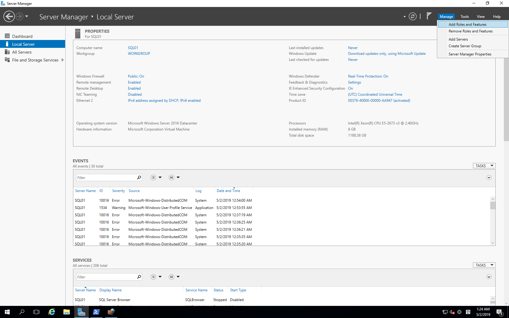

    - 그대로 따라가다가 web server check

    - 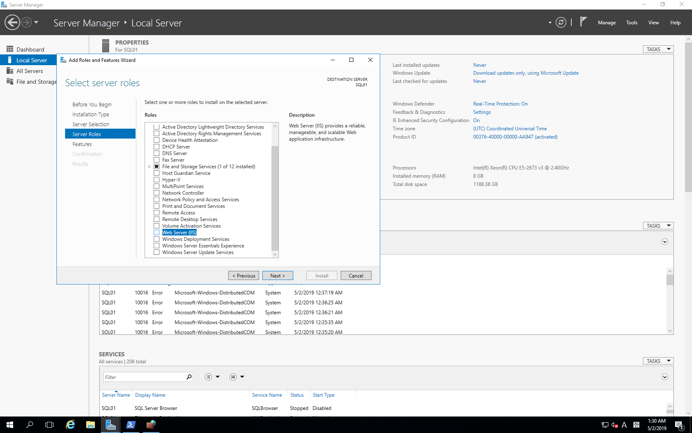

    - 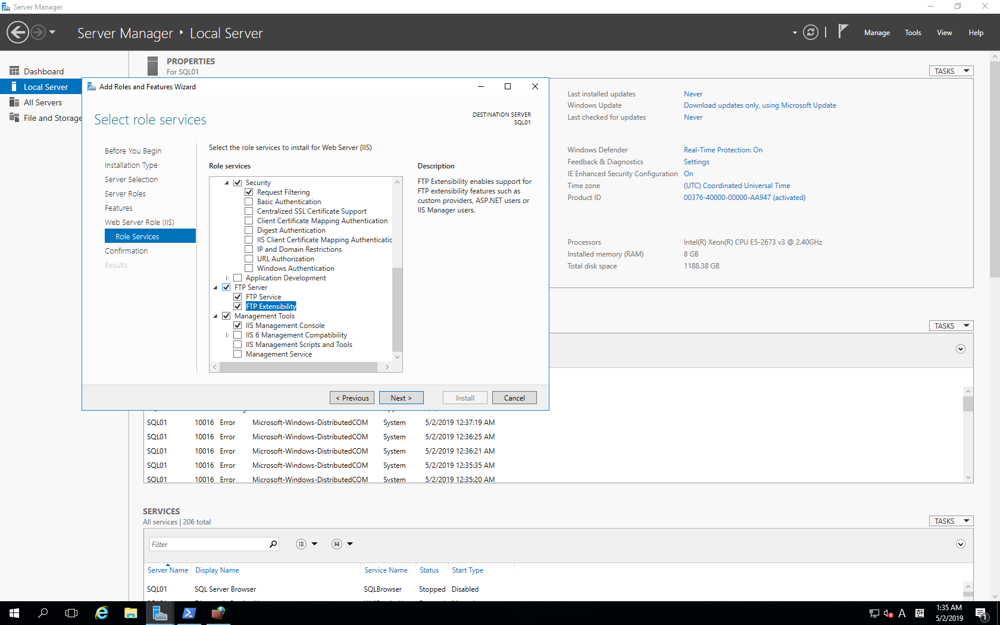
    
  - ftp만 추가 check 하고, IIS 체크된 거 확인!
    
  - Role vs Feature
    
      - Role - 서버 서비스 (16), Web Server(IIS), 
      - Feature - 기능 (35)
    
      
    
    - Web Server Home Directory
    
      - 요 위치에 Web 개발 소스코드들을 저장해야 함!
      - 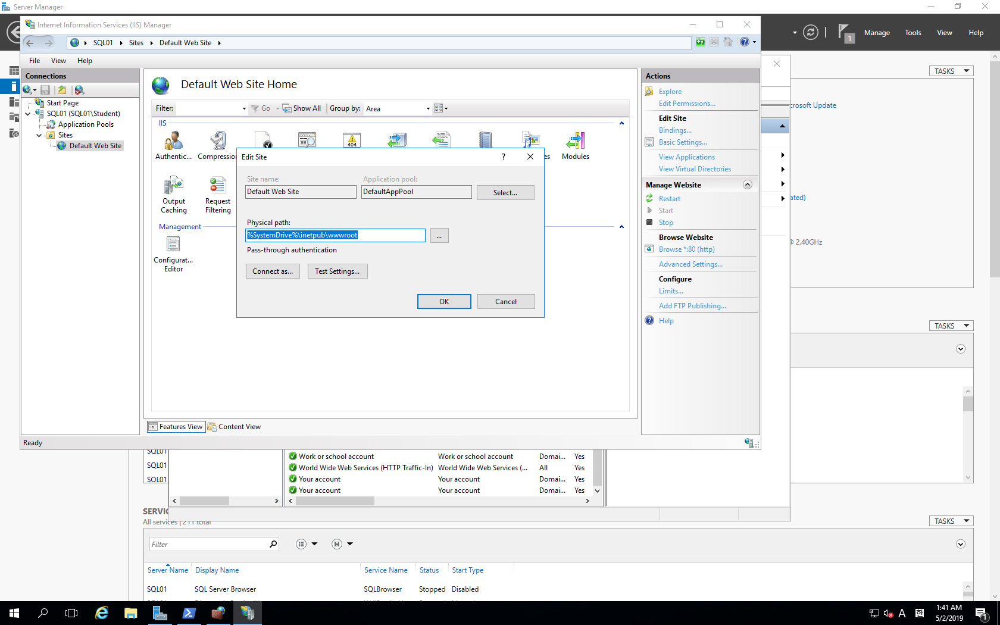
    
    - Default Document (기본 문서) : 많은 문서들 중 client가 최초로 만나는 화면
    
      - index.htm, index.html 등

- Linux (CentOS 7.6)

  - APM(Apache, PHP, MySQL(MariaDB)) 설치

    - `$ sudo yum install httpd php php-mysql php-pod php-gd php-mbstring mariadb mariadb-server`
    - 관련 모듈 설치 php - db 연동 모듈 / mysql client / mysql server
    
  - 서비스 자동 등록 : linux 부팅 시 아래 서비스 자동으로 기동

    - `sudo systemctl enable httpd` 
    - `sudo systemctl enable mariadb`

  - 서비스 시작

    - `sudo systemctl start httpd`
    - `sudo systemctl start mariadb`

  - 서비스 확인

    - `sudo systemctl status httpd`
    - `sudo systemctl status mariadb`

  - 방화벽 시작

    - `sudo systemctl enable firewalld`
    - `sudo systemctl start firewalld`

  - 방화벽 오픈

    - `sudo firewall-cmd --permanent --add-port=80/tcp`
    - `sudo firewall-cmd --permanent --add-port=21/tcp`
    - `sudo firewall-cmd --permanent --add-port=3306/tcp`
    - `sudo firewall-cmd --reload`
      - 변경 후 시스템 리부팅 필요 없이 그냥 reload하면 됨!
    - `sudo firewall-cmd --list-ports`

  - 웹서버 설정 파일 (httpd.conf)

    - 검색 : `$ sudo find / -name httpd.conf`
    - `/etc/httpd/conf/httpd.conf`에 위치함
    - `sudo cat -n /etc/httpd/conf/httpd.conf | grep DocumentRoot`
    - 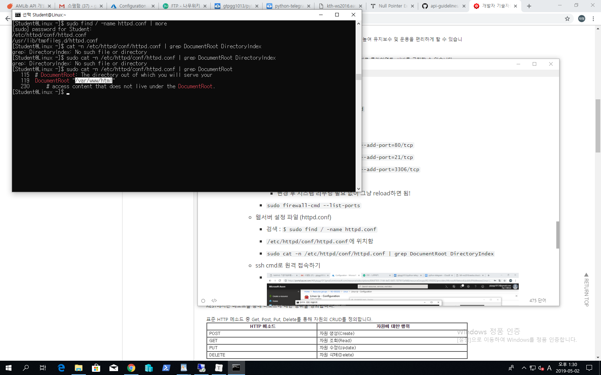
    - var/www/html이 root page 저장하는 폴더임
    - `$ sudo cat -n /etc/httpd/conf/httpd.conf | grep DocumentRoot`
      - DirectoryIndex에 index.html이 root page
    - `sudo vi /var/www/html/index.html`

  - PHP 작동

    - `sudo vi /var/www/html/phpinfo.php`

    - ```vi
      <?php
      		phpinfo();
      ?>
      ```

    - <http://kth-linux01.eastus.cloudapp.azure.com/phpinfo.php> 에서 확인가능

  - ssh cmd로 원격 접속하기

    - 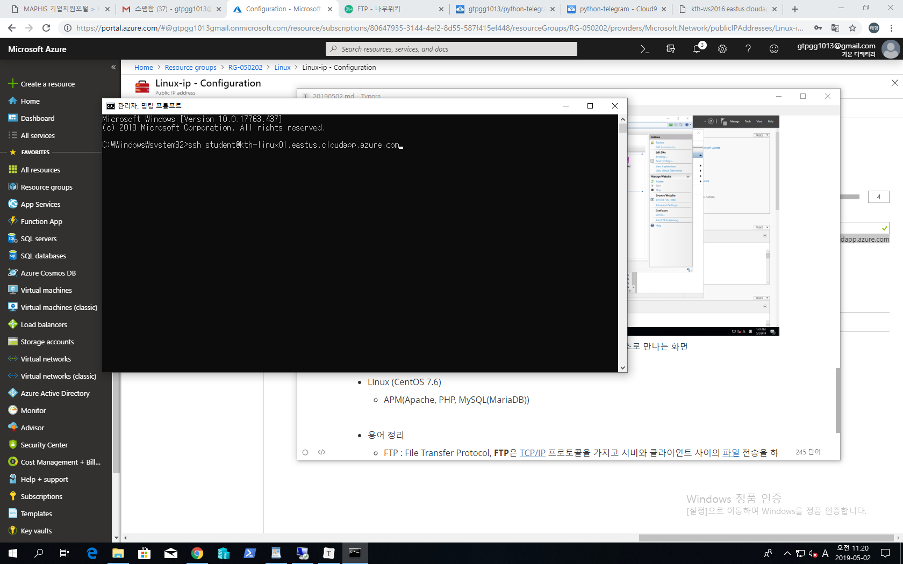
    - Student 대소문자 구분
    
    

- **PaaS 환경에서의 Web App**

  - 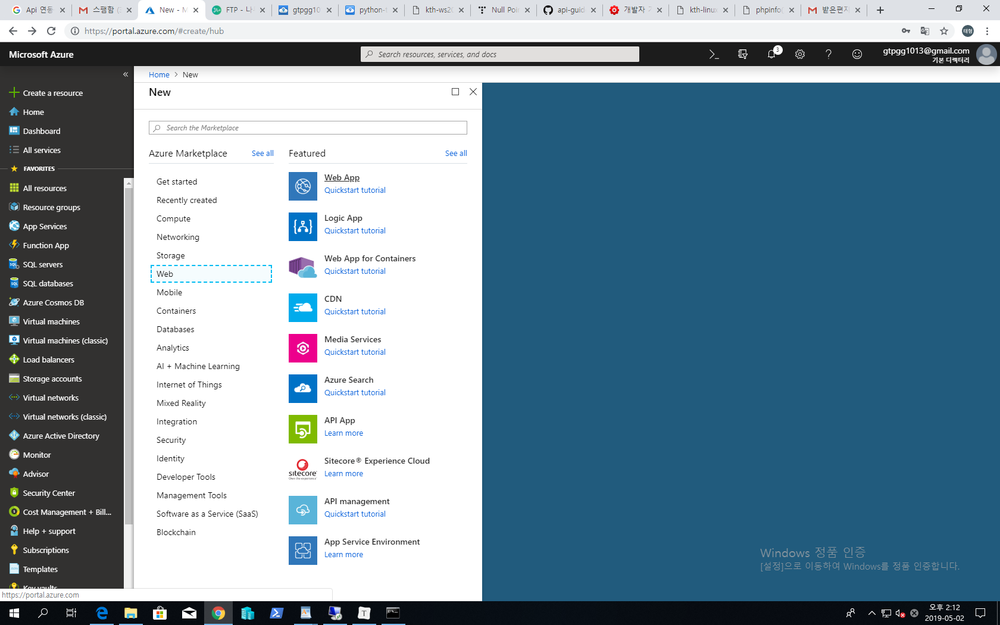

  - web app 만들어주면 됨

  - 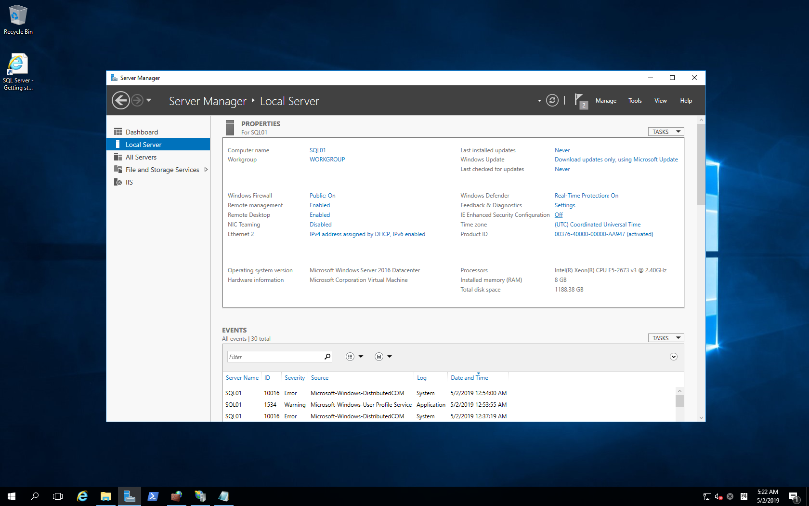

  - 그다음 VM에서 IEESC off

  - 그 후 vs code 설치 - auzre module 설치해서 거기서 html default file 열어서 관리할 수 있다!

  - FTP

    - 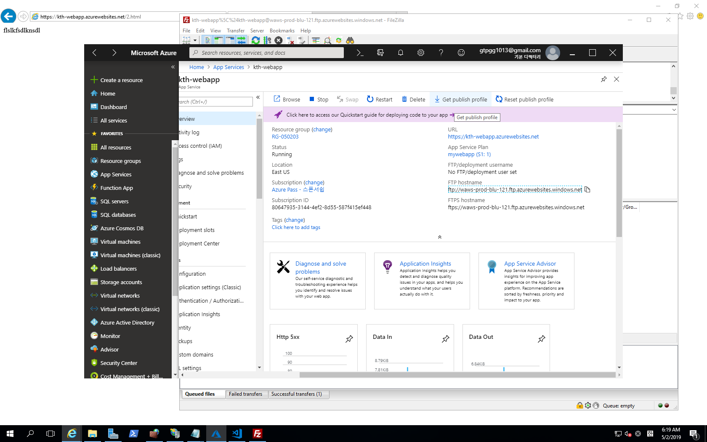
    - 일단 publish profile file 다운받아서 확인 - 여기에 ID PW 정보 있음(notepad로 확인)
    - 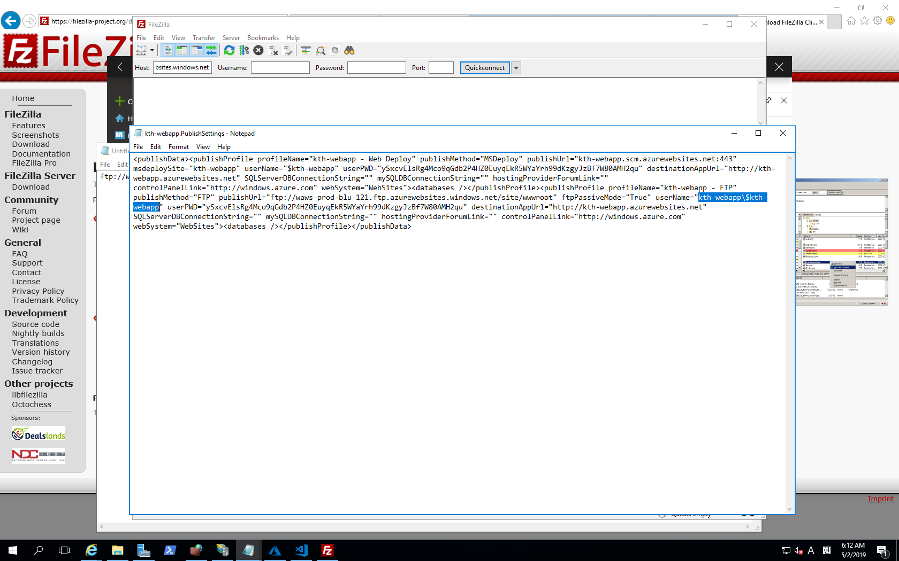
    - 여기서 ID PW 받아서 filezilla로 접속
    - 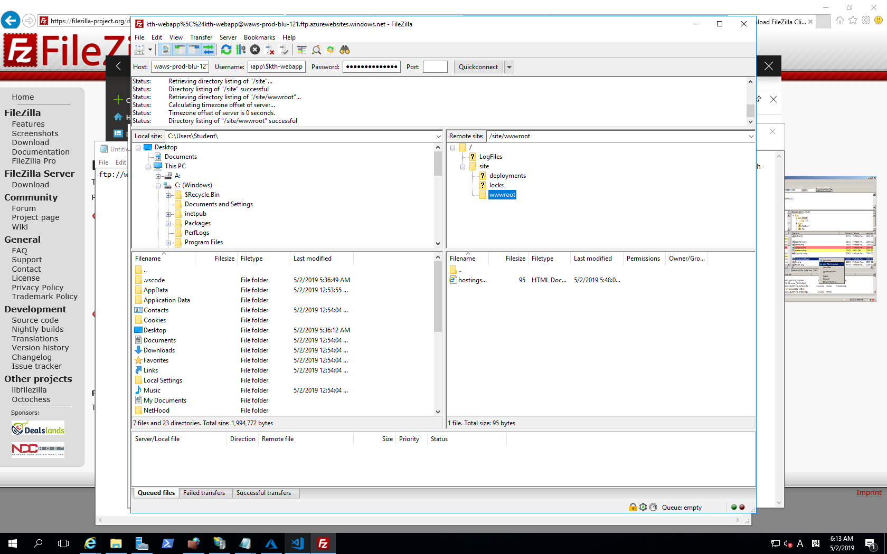
    - 주소는 그냥 PaaS 서버의 ftp주소 넣어주면 됨
    - 하나 암거나 작성해서 파일에 넣어주면 확인할 수 있음
      - 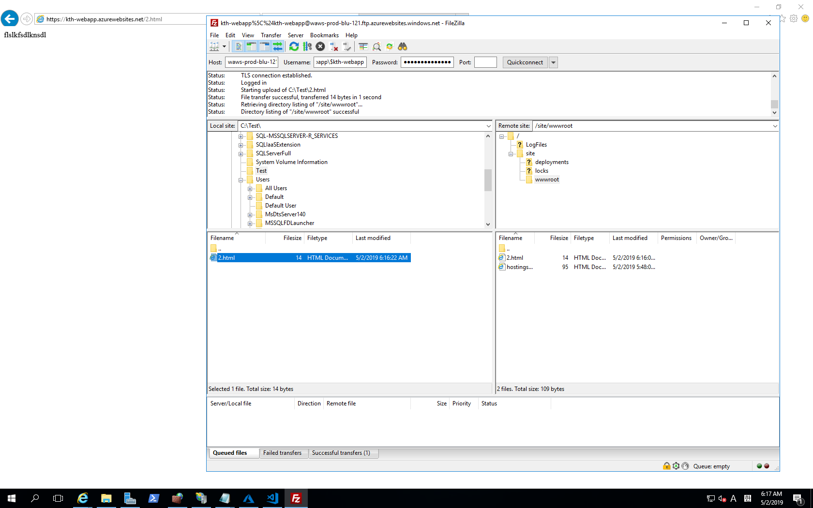
      - 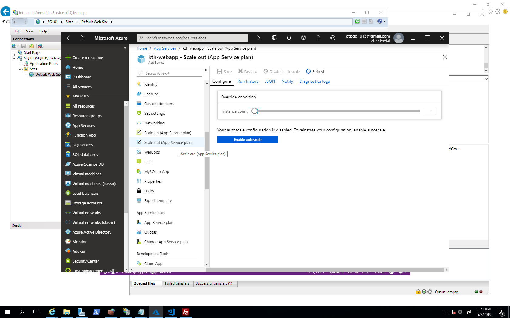
      - 사용자 많을 때 자동 확장 옵션 -> scale out : 사용자 증가시 성능 고려해 여러개 사용
      - scale up : 더 좋은 컴푸터 사용하기
    - 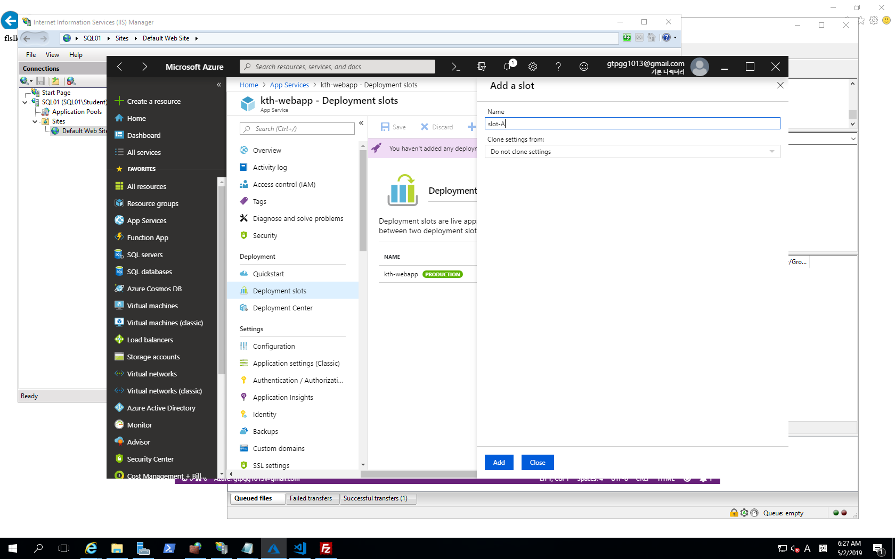
    - slot 하나 만들기
      - slot : 코드변경 하는 단계에서 test하는 환경(실제 서비스는 running 중) : 수정하는 곳
      - 수정 후 swap하면 slot의 환경이 production의 환경으로 update됨

    - 워드프레스 생성
      - new resource : wordpress (기능이 미리 setting 된 web app)
      - 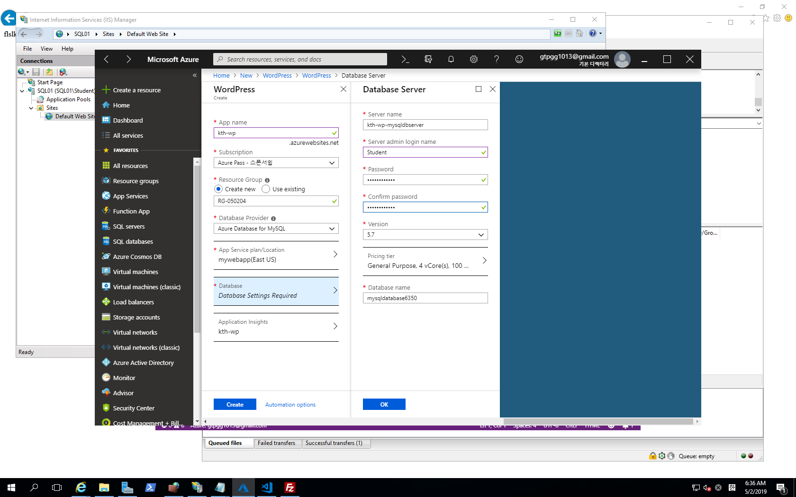
      - 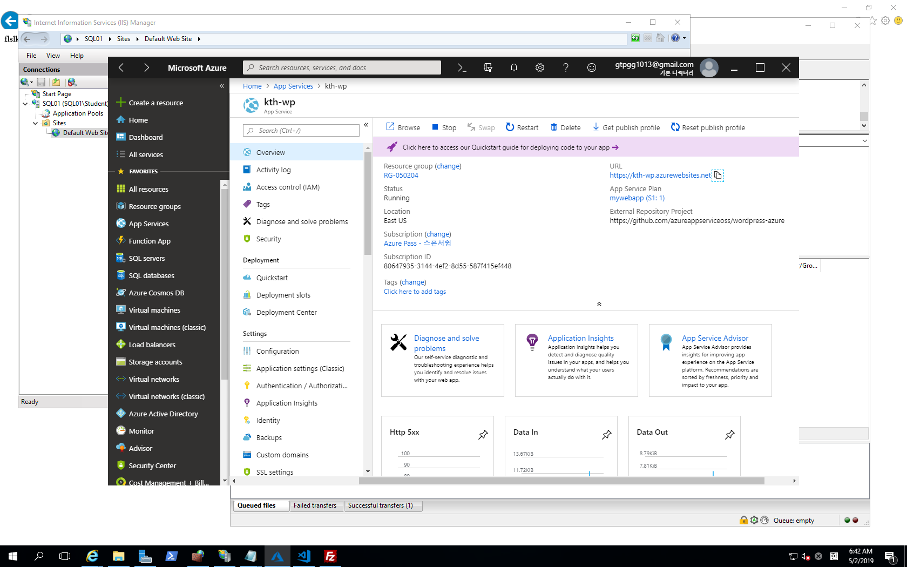
      - 저 url로 접속 가능

- 실습

  - 20533_05 Traffic manager

    - Data center(region) 간 부하분산 /  (LB는 VM들에 대해 부하분산)

    - Application level에서 DNS기반 부하분산 - L7계층에서 부하분산 (DNS에서 별칭 줘서 분산)

    - client가 빠르게 처리받을 수 있는 region의 Data Center 지정해줘서 처리하게 함

      - 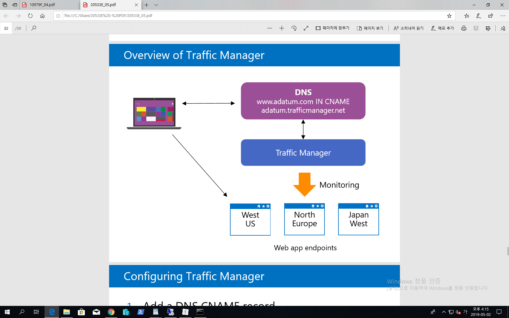

        

        

  - 실습 1은 그냥 Web app 만들기

  - 2는  배포 : 근데 **F:\LabFiles\Lab05\Starter\AdatumWebsite** 이게 뭔데 debugging 하면 실행되지?

- 용어 정리

  - FTP : File Transfer Protocol, **FTP**은 [TCP/IP](https://ko.wikipedia.org/wiki/TCP/IP) 프로토콜을 가지고 서버와 클라이언트 사이의 [파일](https://ko.wikipedia.org/wiki/컴퓨터_파일) 전송을 하기 위한 프로토콜
  - rpm -qa <패키지이름> : linux에서 패키지 설치되었는지 확인하는 명령어

- 추가 자료

  - <https://www.microsoft.com/en-us/learning>
    - <https://www.microsoft.com/en-us/learning/azure-administrator.aspx> 
    - Azure 인증 시험 
  - REST API
    - 컴퓨터 시스템을 서로 연동해주는 아키텍쳐
      - REST : 표준은 아님 : just 개념
      - 잘게 쪼개서 필요한 부분 조립
    - 리소스, 메소드, 메시지로 구분됨
      - 리소스 : 접근할 대상 : URI로 식별
        - http://api.domain.co.kr/books
        - http://api.domain.co.kr/books/1/
        - http://api.domain.co.kr/books/1/photo
        - sports/soccer/players/1/ : 컬렉션/아이템/컬/아
      - 메소드 : 어떤 자원에 대해 어떤 행위를 할 지 (CRUD) : 각 자원(URI) 에 대해!
        - POST : 자원 생성 (CREATE)
        - GET : 자원 조회 (READ)
        - PUT : 자원 수정 (UPDATE)
        - DELETE : 자원 삭제 (DELETE)
      - 메시지 : http 헤더 / 바디 : 메시지 처리하기 위한 충분한 내용을 포함
        - 응답 상태 코드