# 2019/04/26

# MS Azure lec #4

- ##### 복습

  - 네트웍 아이디 (우편번호) : 라우터를 찾아감
  - 호스트 아이디 (번지) : 각각의 컴퓨터를 찾아감
  - Subnet Mask
  - Gateway
  - DNS
  - 요 위에 5개가 네트워크 셋팅의 주요 요소
  - 라우터 인터페이스 세팅할 때 Gateway나 DNS는 설정할 필요 X (라우터 자체가 Gateway)
    - 라우터의 서브넷 마스크 할당에 따라 호스트 사용량을 조절할 수 있음
    - 네트웍에 호스트가 너무 많으면 브로드캐스트가 너무 많이 일어남 : 네트웍 성능 저하
      - 그래서 Sub network 만듬 : for 성능 / for 보안
  - Private IP 나갈 때는 Public IP로 라우터에서 변환되어야 나갈 수 있음(NAT) 

- DNS 이름풀이 과정

  - DNS **캐시**에서 IP 확인 (TTL 기간만큼 존재)

    - 장점 : 서버의 부하를 줄여줌 / 자기 메모리에서 가져오니까 빠름
    - 단점 : 부정확한 값을 가져올 수도 있음(서버내용 변경 / 수정시)

  - 클라이언트가 캐시가 없을 시 자기 TCP/IP에 등록된 DNS server(local DNS server)에게 물어봄

  - root DNS (13대) : 주요 DNS 서버의 주소 가르쳐줌 : .com / .kr / .org

  - .com DNS : .com 앞에 있는 도메인 서버의 주소를 가르쳐줌 (EX. Microsoft)

  - Microsoft.com DNS : www Host에 대한 microsoft의 IP를 알고 있음 ==> 이걸 가르쳐줌

  - 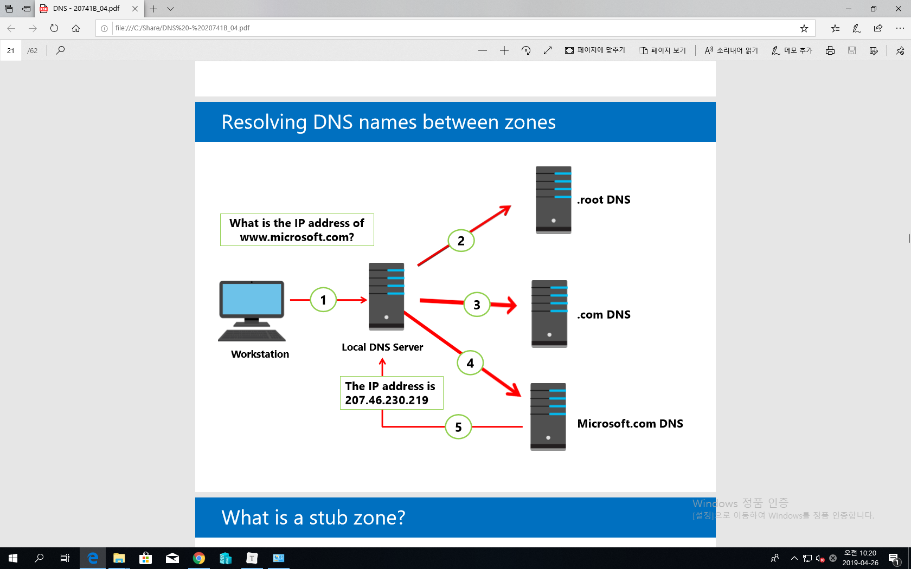

    

- Azure에서 DNS Zone 만들기

  - 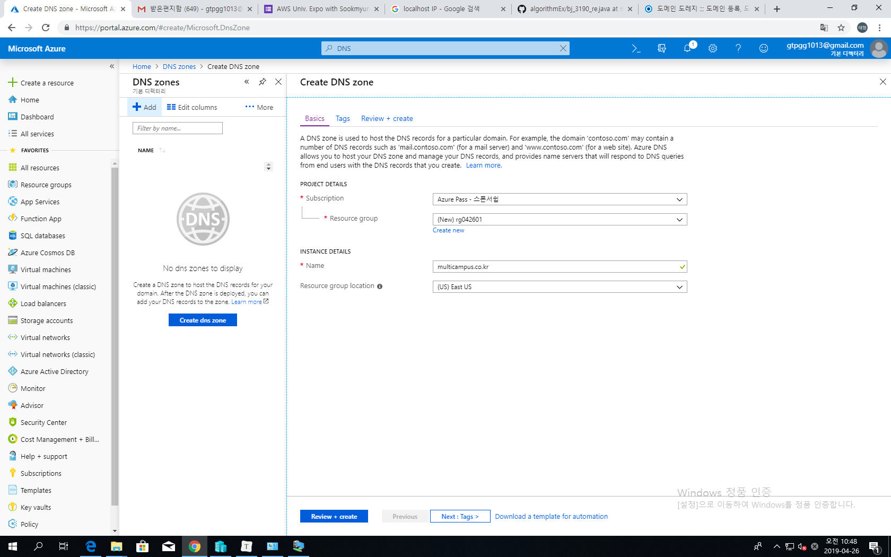
  - DNS 서버는 Web / FTTP 모든것들의 기반요소 => 되게 중요하다
  - 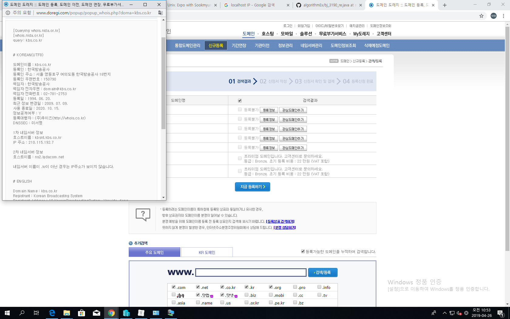
  - 그래서 1차, 2차 네임서버로 나눠서 저장
  - Zone : DNS DataBase (multicamcam.co.kr)
    - Azure에서 기본적으로 제공해주는 domain name은 너무 길다!
    - 또는 회사가 가지고 있는 이름으로 바꾸고 싶다 => Domain Zone
  - 레코드 <== Zone 내에서 실제 일을 처리하는 것
    - A : 호스트 이름을 IP로 변환
    - AAAA : 상동 (IPv6)
    - CNAME : 호스트 이름을 다른 호스트 이름으로 변환
      - ftp.adatum.com -> host1.adatum.com
    - MX : 메일 서버를 지정
      - 해당 도메인에 메일을 보내기 위한 레코드
    - SRV : 서비스의 위치를 지정
  - 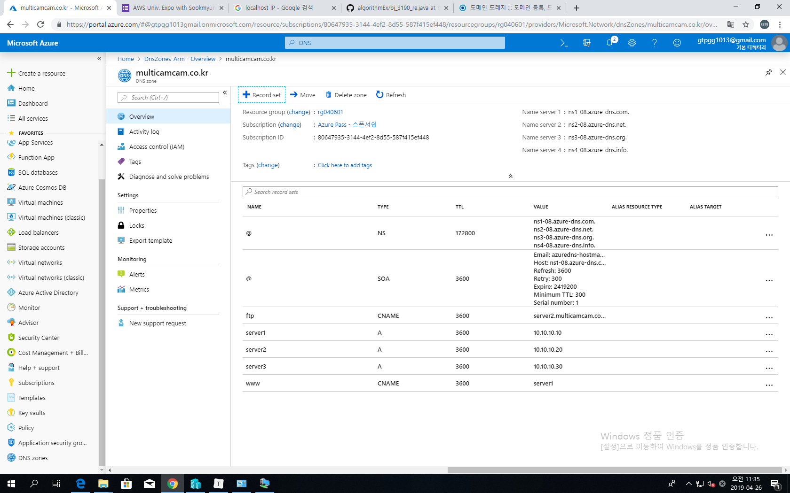
  - 실제 도메인 등록하면서 NS 항목(Name server) 을 내야 함(여기에서 실제 도메인 네임/IP 저장하고 있음)
  - 서버의 레코드 변경할 때 TTL 고려해서 수정!

- What are Azure virtual network?

  - Vnet : 개인 네트웍을 만들 때는 보통 private IP 사용

  - 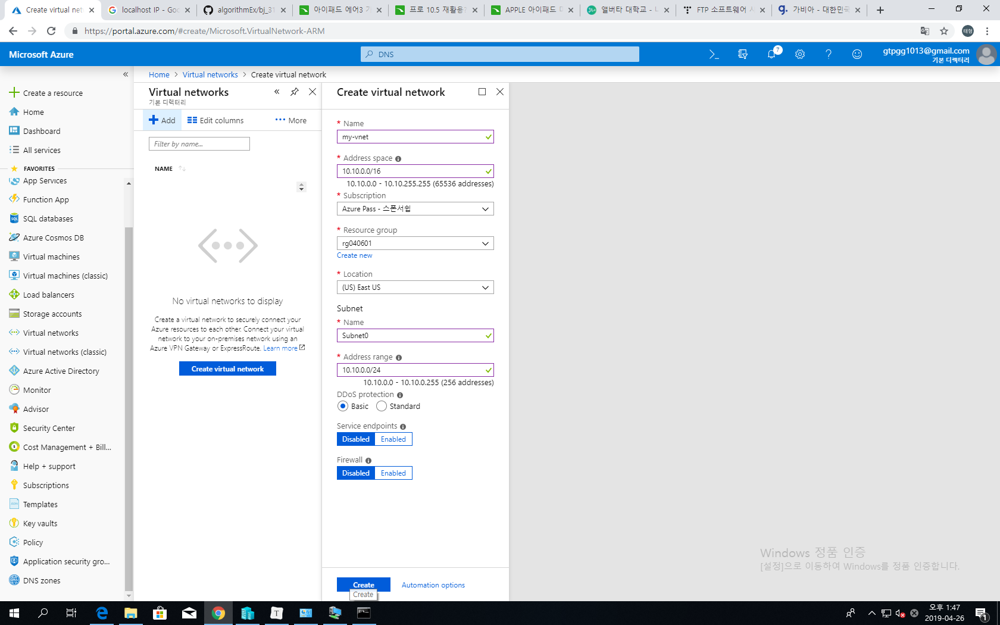

  - 가상으로 네트워크 구축 후 서브넷 사용해서 분배하겠다~

  - 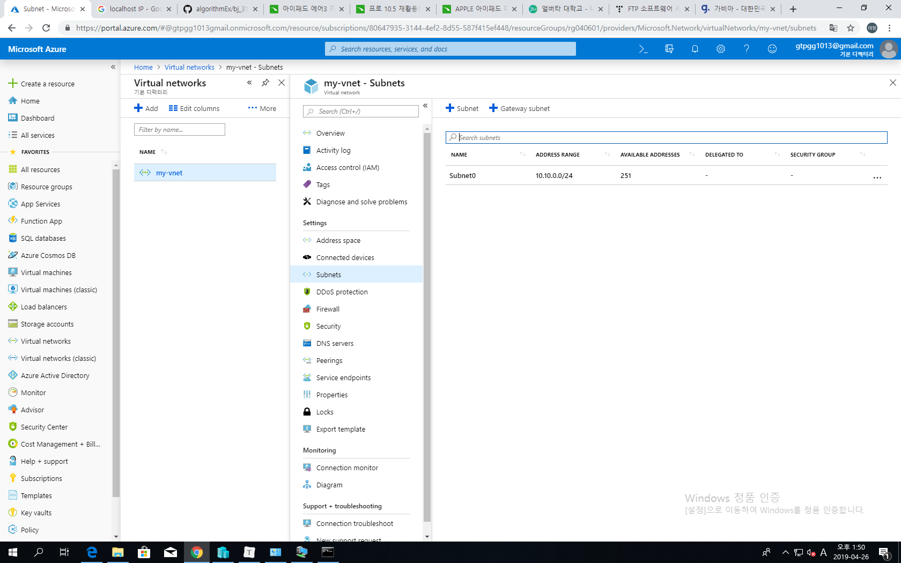

  - 251개인 이유 : 네트워크 아이디, 브로드캐스팅 + 1,2,3은 Azure에서 예약해서 씀 (256-5)

    

  - Azure에서 나눌 수 있는 최소 subnet은 /29까지 : 8 - 5 = 3 (사용가능)

    - 실전에서는 Subnet과 Subnet은 라우터 장비로 구분됨 (물리적)
    - but Azure에서는 없이도 가능 : Automatic but customizable routing
      - Azure가 자동으로 라우팅 해줌 : 혹은 라우터를 넣을 수도 있음

  - Built-in but customizable DNS name (DNS 그냥 쓰거나 아니면 재정의하거나)

  - support for TCP/UDP/ICMP

  - 한개 이상의 IP subnet 가능

  - 보통 private / public 쓰고 싶으면 구매해서 해야 함

  - Private: Based on RFC 1918

    - 10.0.0.0 – 10.255.255.255  /  a class
    - 172.16.00 – 172.32.255.255  /  b class
    - 192.168.0.0. – 192.168.255.255  /  c class

  - cross-virtual network (타 VNet과 연동가능)

  - cross-premises connectivity (on-premise의 네트웍에서도 접근가능)

    

  - VNet을 **반드시 포함해야** 하는 Resources :
  
    - Virtual Machine
    
    - Virtual Machine scale set : VM이 많아지면서 확장해나가는 서비스
      - 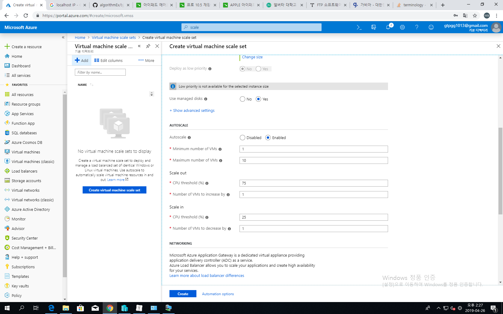
      - 75퍼 되면 VM 하나 더데려오고 / 25퍼 되면 VM 하나씩 줄여나가고
      - scale out : 수평확장
      - scale up : 수직확장
    
    - Azure Application Gateway (Internal) : NLB : 사용자의 부하 분산 (L7 layer에서 이루어짐)
    
      - NLB : Network Load Balancer
    
    - Azure App Service Environment
    
    - Azure Kubernets Services
    
    - Service Fabric
    
      
    
  - VNet을 **support**하는 Resources (기본적 Paas, 이거를 갖다 쓰는거는 VNet 안쓰는데 Customize 하거나 특수히 관리하려면 그 네트워크 안에 들어가야 하므로 VNet 써야함)
  
    - Point-to-site VPN (Virtual Private Network)
    - Service Endpoints : VNet을 통해 받을 수 있는 실제 서비스 (Ex. Azure Storage, SQL Database 등)
  
  - Azure network capabilities
  
    - Traffic routing : 서브넷 사이에 라우터를 만들어서 경유해서 통신하도록 만들 수 있음
    - Load balancing : L4 layer에서 제공되는 부하분산장치 : internal / external
    - Traffic filtering : Network Security Group / Application Security Group : 방화벽
      - 패킷 걸러서 사용 가능
    - Direct PaaS connectivity : PaaS 서비스들을 VNet 통해서 외부에서 접속 가능
    - Virtual network connectivity : P2S VPN / S2S VPN / ExpressRoute
      - Cross-Vnet : Vnet peering, VNet-to-VNet
  
  - Azure virtual network connectity options
  
    - 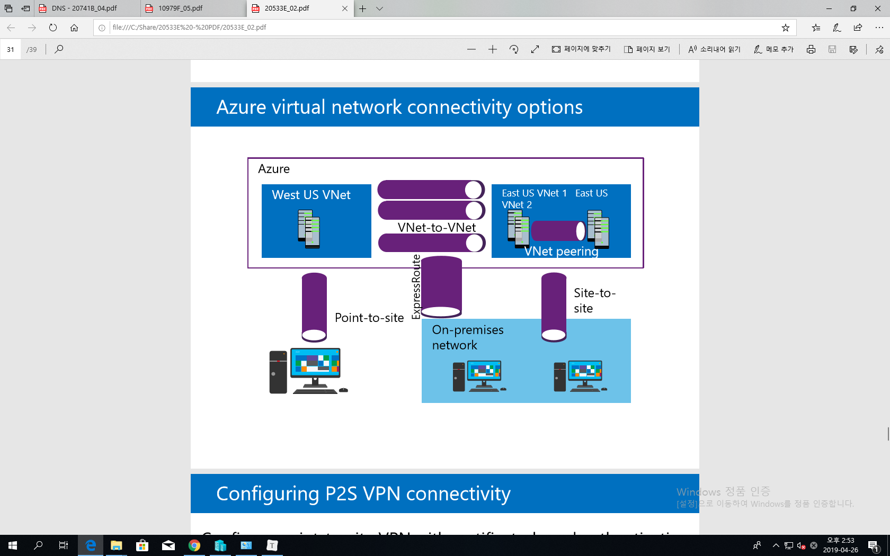
    - Point-to-site : 한대의 Host(컴퓨터)가 하나의 VPN 통과하여 VNet 접근하는 것
    - Site-to-site : 라우터단에서 VNet으로 VPN 터널링하여 사용
    - ExoressRoute : 회사에서 Direct로 Azure환경으로 터널 뚫음 (without Router) : 전용선 사용
    - VNet-to-VNet : 다른 데이터센터 두 VNet을 그룹핑하는것
    - VNet Peering : 같은 데이터센터내에 두 Vnet을 그룹핑하는 것
    - 네트웍 - 네트웍 간 IP 겹치지 않도록 조심
  
  - 3 Tier
  
    - Web
    - Application
    - DataBase
  
  - Private IP address space : 프라이빗은 정해진 범위 있기 때문에 그 범위 따라줘야 함
  
  - Network Security Groups : 방화벽 사용 가능
  
  - Load Balancer : 부하분산장치
  
    - https : SSL(암호화 통신)
    - VM 여러대로 부하를 분산시켜줌
    - frontend IP : 공인 IP
    - Inbound NAT rules : LB에 들어올때는 public IP로 들어오기 때문에 LB에서 사용하는 Private로 바꿔줘야 함 ; 나갈때는 반대로
    - Load balancer rules : 패킷이 들어올 때 IP와 port 맵핑해서 어떤놈 부하처리하겠다 설정(규칙)
    - probe : VM들의 상태 check, 부하 상태(health 상태), 죽었는지 살았는지
    - backend pool : Load balancer가 부하분산할 장치(VM들)를 등록하는 단

- 추가 내용

  - Cloud 잘 하려면 : Network / Server / Storage에 대한 광범위한 이해 필요
    - +a DNS 등
  - filezilla
    - 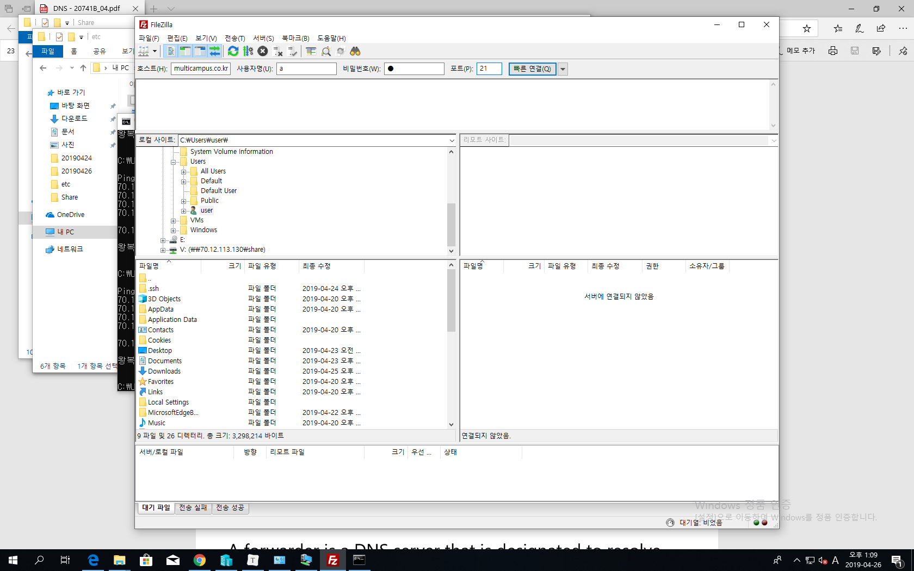
  

- 명령어

  - DNS 캐시

    - ipconfig /displaydns <== DNS Cache 확인

    - ipconfig /flushdns <== DNS Cache 삭제

    - C:\Windows\System32\drivers\etc\hosts

    - 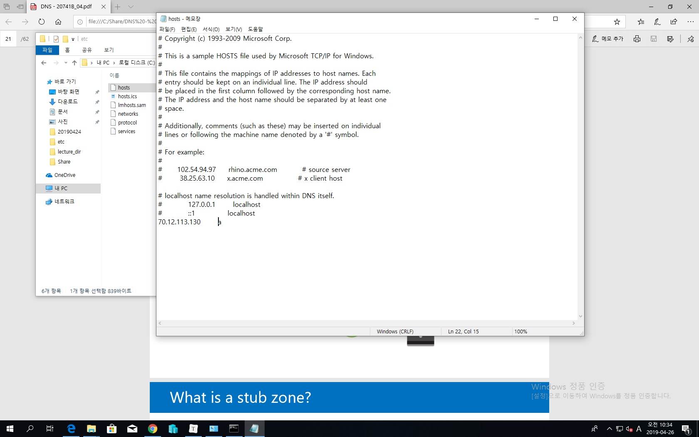

    - 초창기에는 DNS 안쓰고 hosts 파일 사용해서 아이피에 따른 간단한 이름 줄 수 있었음

    - 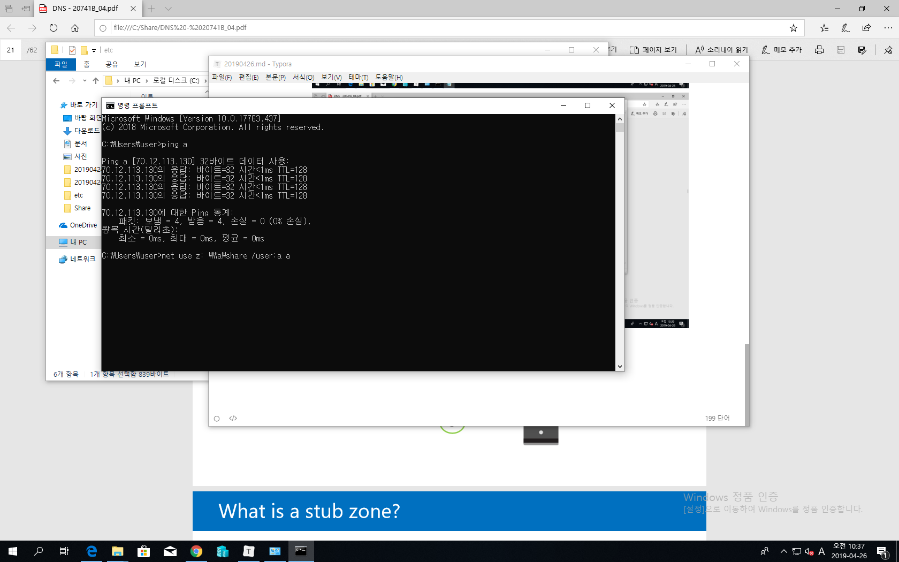

      

    - www.doregi.com : 도메인 서비스

    - www.internic.org : 전체 도메인 관리
    
    - <실습> DNS name 지정하려면 : IP 들어가서 : configuration 가서 : rg2019042601.eastus.cloudapp.azure.com 로 설정 후 로그인
    
    - mstsc /f /admin /v:rg2019042601.eastus.cloudapp.azure.com
    
    - 비밀번호 재설정 : VM : Reset Password
    
    - ID Password 같은거 절대 복붙 ㄴㄴ 손으로 써라 ==> 이거 수정하려면 시간 2만배 더걸림
  