# 2019/05/03

# MS Azure lec #8

- <https://gmlwjd9405.github.io/2018/08/31/algorithm-union-find.html>
  
- 알고리즘 참고 사이트 : Union-find
  
- ## 복습
  
  - PaaS vs IaaS <웹 앱>
    - IaaS는 scale in out을 할 때 VM 자체 용량이 크기 때문에 신축성이 크지 않다
      - MS Server : IIS : 웹서버 / ftp 서버 세팅 : Web server home directory 설정
      - default document가 맨 처음 열리고 그 다음 client의 click이 server에 문서 요청하는 것
      - linux : APM(Apache, PHP, MySQL(MariaDB))
      - firewalld 명령어(동적:dynamic) 사용 : 재부팅 필요 없이 reload로 해결 가능
        - iptable 명령어는 정적이기 때문에 안씀 : 시스템 리부팅 필요
      - 웹서버 설정 파일 : http.conf : DocumentRoot / DocumentIndex
    - But PaaS는 웹 앱만 빠르게 쓰고 지우면 되기 때문에 신축성이 크다
    - 그래서 나온 것이 Serverless (VM도 필요 없다!)
    - Docker
    - Production 환경 vs Slot 환경 : 서비스를 내릴 필요없이 수정 가능! (Swap)
    - Load Balancer(TCP,UDP,port별 LB : L4) VS Traffic Manager(DNS/Region 기반 트래픽 처리 : L7)
  
- Configuring and Mananging Azure AD (Active Directory)

  - Azure AD(AAD) (PaaS) - 밑단은 MS에서 관리 

    - 클라우드 상에서 Azure의 리소스 및 서비스를 사용자에게 허가하는지 안하는지를 관리하는 솔루션
    - 나는 계정만 만들고, 권한만 주면 됨
    - 하나의 계정에서 여러 보안 바운더리(tenant)를 만들 수 있음 (multi-tenant)
    - OU / computer object 없음
    - RBAC role에서 권한을 위임(delegation) 할 수 있다
    - Active Directory : Directory Service (계정, 그룹, 네트웍의 정보를 디렉토리에 저장)
      - X.500(디렉토리 서비스 표준)
      - 디렉토리 서비스의 MS버전
      - 중앙화된 보안 관리
      - 중앙화된 관리 (GPO)
    - Domain : 물리적 각각의 단위를 논리적으로 집합시킴
      - 보안의 논리적인 범위 (boundary)
      - DC(Domain Controller) : 도메인의 보안을 관리하는 시스템(Active Directory를 설치해줌)
        - 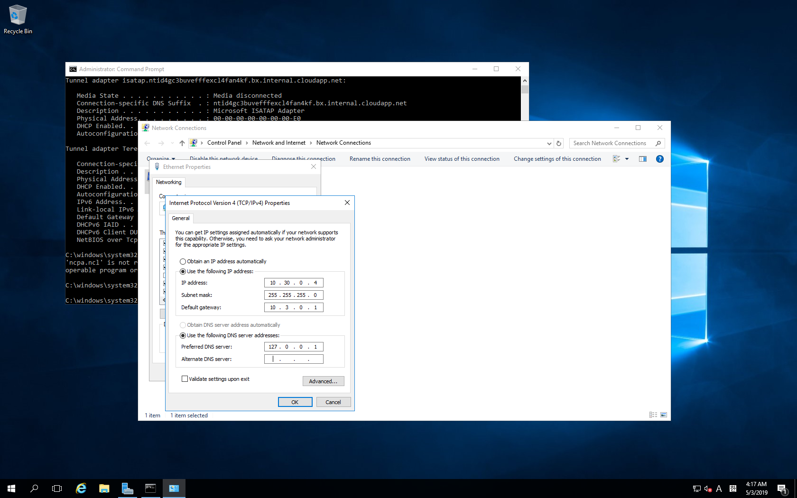
        - DC의 IP는 바뀌면 안되기 때문에 고정으로 설정
        - 여기에 AD 설치하고, DNS 서버가 여기서 작동
      - 중앙화된 관리
      - ID/PW를 넣었을 때 DC에서 인증받음(WG은 자기 컴퓨터 SAM에서 인증)
        - WG에서는 계정을 엄청 많이 만들어야 하나, Domain에서는 간결히 접속 가능
      - SSO (Single Sign On) : 한번 접속으로 가능 
      - GPO
    - 실습
      - 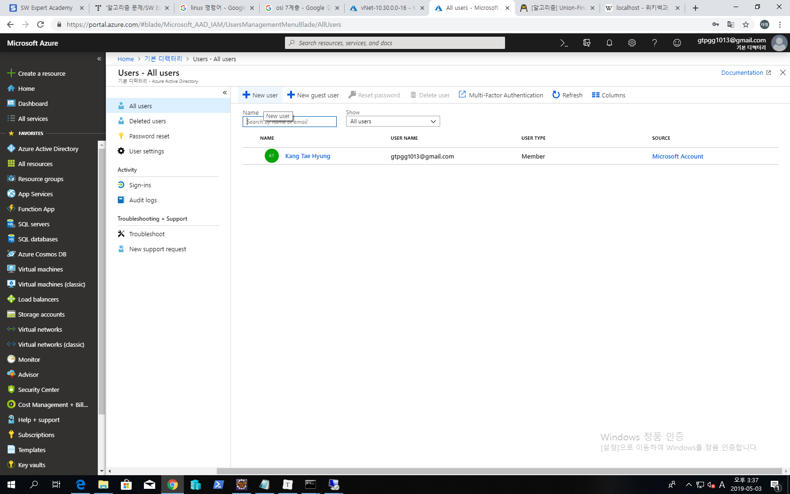
      - New user 만들기
      - 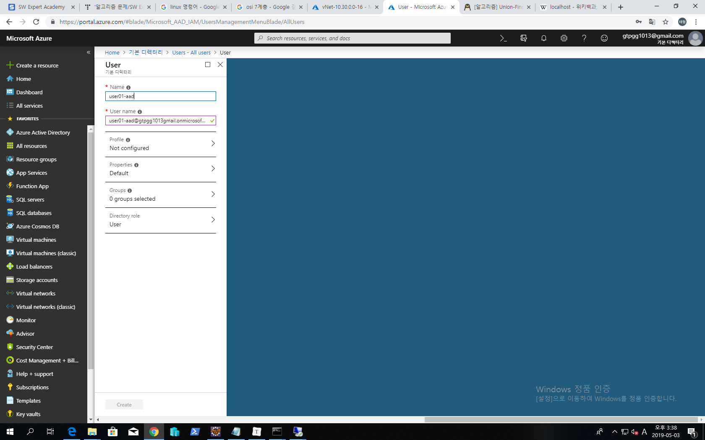
      - 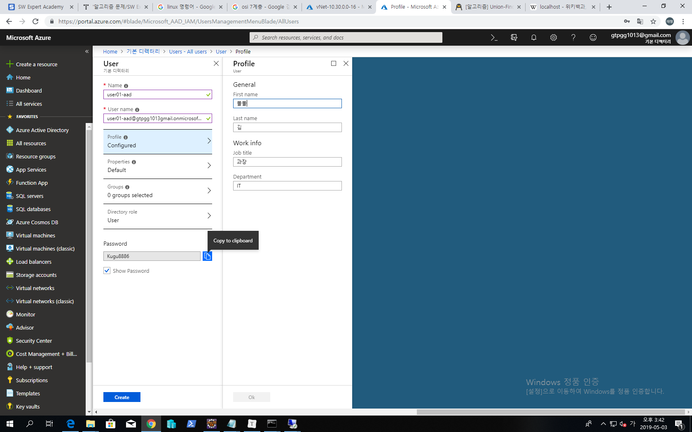
      - profile 작성
      - ID/PW 메모장에 기억해두자
      - 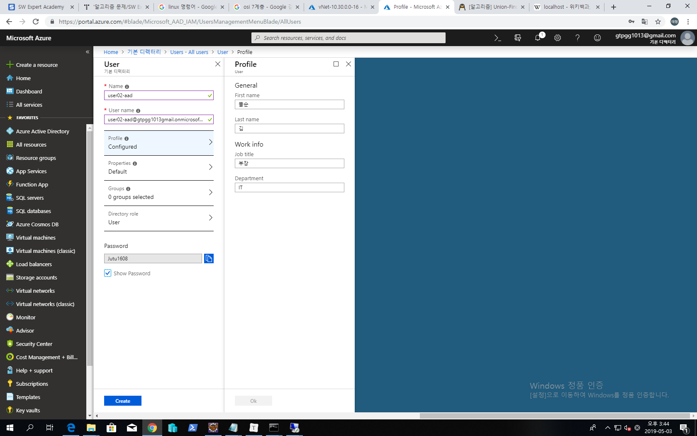
      - 하나 더 만들기
      - 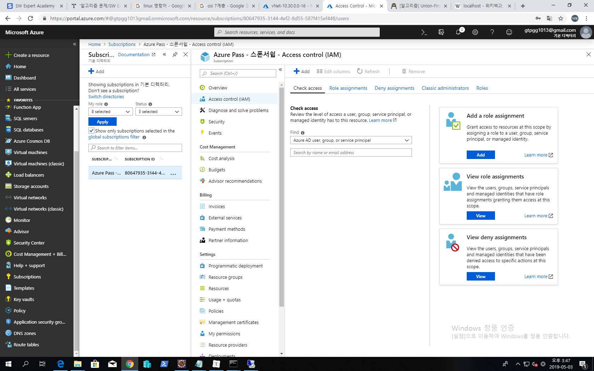
      - IAM으로 이동 (어떤 계정이 이 subscription 안에서 사용할 수 있는 권한을 부여하기)
      - Authentication (인증) : ID와 Password를 확인
        - On-premise : DC에서 확인 (도메인)
        - Azure(cloud) : AAD에서 확인
      - Authorization (허가)  : 리소스 접근 권한
        - Subscription level에서 권한을 부여하면 밑 RG나 R에게도 권한이 자동으로 부여
        -  Subscription > Resource group > Resource
      - 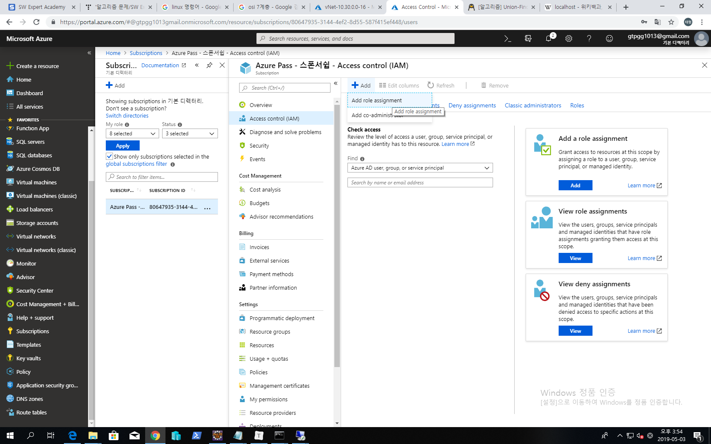
      - Azure에서 만들어 놓은 role 사용할 수도, customzing 할 수도 있다
      - 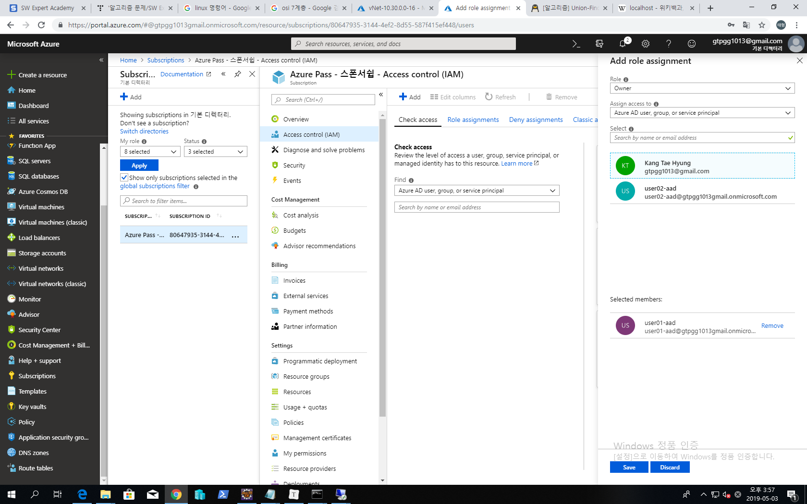
      - 일케 user01-aad에게 owner 권한을 주면 얘는 뭐든 다 할수 있다
    - WorkGroup
      - 각자 시스템이 보안을 관리
      - 자신의 시스템에서 인증
      - 기업의 시스템이 20대 미만
      - 자신의 시스템의 SAM 인증 : C:\Windows\System32\config : SAM(security account manager)
        - 내 컴퓨터에서 만든 계정, 그룹의 정보 보관 file
        - 인증이 완료되면 Token이 만들어짐
        - Token?
        - 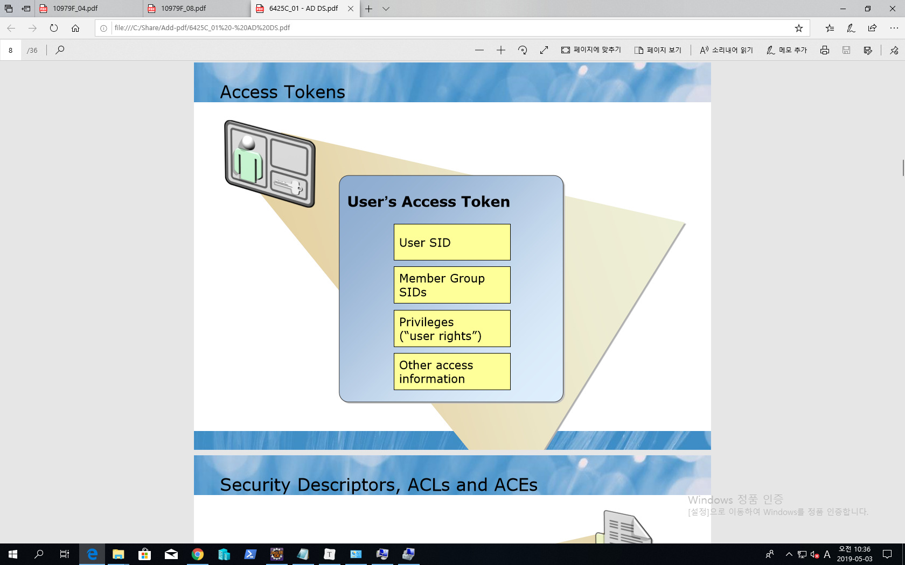
        - 위 4개의 요소 포함 : SID(추가 내용 설명) & privileges(권한) & othe access info.

    - AD 5 Services
      - AD DS : Active Directory Domain System : 이걸 기반으로 밑 4개 작동 가능 (On-premise)
        - AD 객체를 담고 있음 : 계정정보, DC의 모든 정보 다 가지고 있음
        - Domain base 프로그램의 인증 및 허가
        - GPO를 가지고 도메인의 정책을 설정해서 도메인 안의 다른 컴퓨터에게 적용!
          - cutomizing / OU(organization unit) : GPO 만들어서 특정 부서나 특정 컴퓨터에만 정책을 적용할 수도 있다
        - fail을 대비해서 최소 2대 이상의 DC를 가져간다
        - forest : 도메인의 확장적 의미
      - AD LDS : Lightweight : AD의 객체 속성의 일부
        - DMZ존의 Exchange서버(메일) 이용시 씀
      - AD CS : Certificate : 인증서 배포 서버
      - AD RMS : Rights Management : 권한 관리
      - AD FS : Federation : 도메인과 도메인 사이에 Federation(원청-하청)
        - 원래는 원청사원이 ID/PW를 하청사원에게 줘야 하는데, 회사와 회사간의 federation을 맺으면 회사차원에서 인증받아 접근 가능
  - multi-factor authentication 
    - 여러군데서 접근하면 인증코드 주거나 다른곳에서 접속했습니다~ 가르쳐주기

- 추가 내용

  - SID (Security ID)
    - 사용자 계정, 그룹, 컴퓨터 계정 생성시 
    - Adminstrator <==> 숫자로 된 고유 번호 발급 : SID
    - 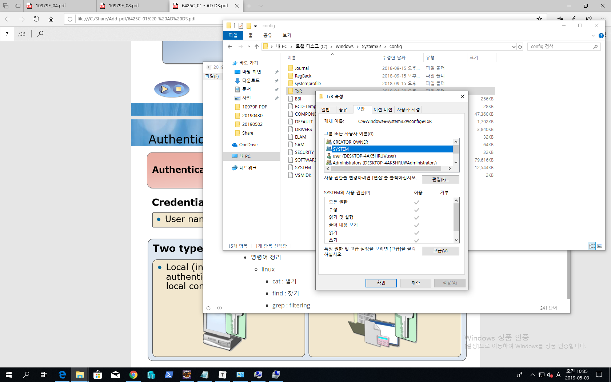
    - 어떤 멤버가 파일에 접근할 수 있는지 그룹으로 효율적 관리

- 실습  (Azure VM 위에 Azure AD DS 서비스 올리기) - IaaS 서비스

  - window server 생성
    - Domain Controller 만들기
    - SVR1 만들기
  - vNet 생성
    - 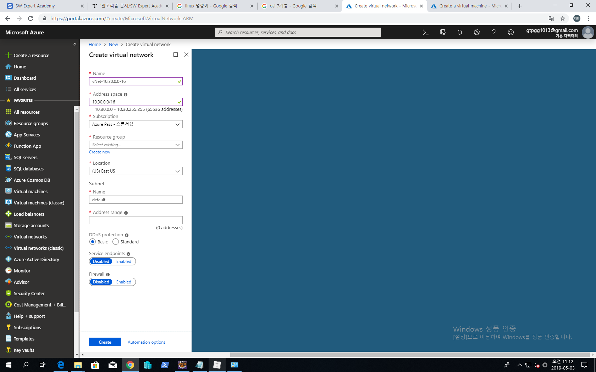
    - DC 구성
      - 고정 IP
      - AD DS Role 설치 (서버관리자)
        - DC에서 add role and features 가서 AD DS 설치
      - DC Promotion
        - multicampus.com
      - 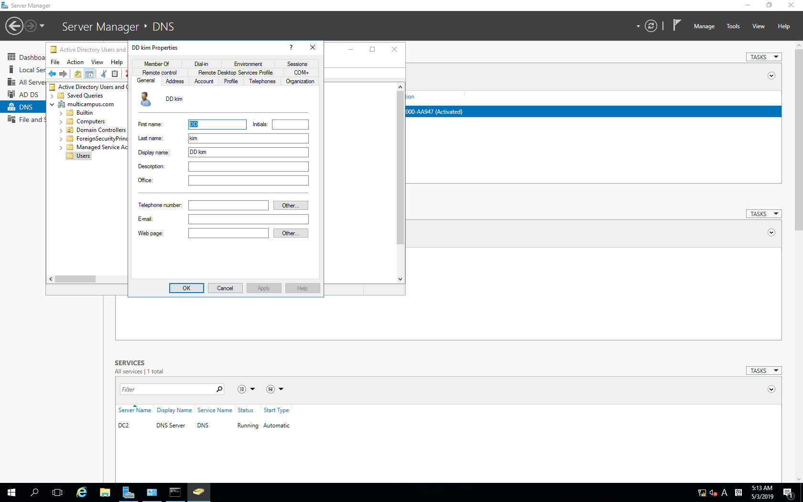
      - DC에서 김똘똘이라는 user 만들어주고(user_kim) Domian Admins 권한 부여 
      - 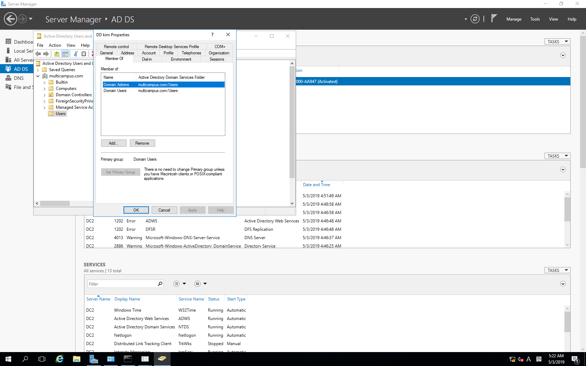
      - 그리고 svr을 도메인에 넣어주는 것
      - 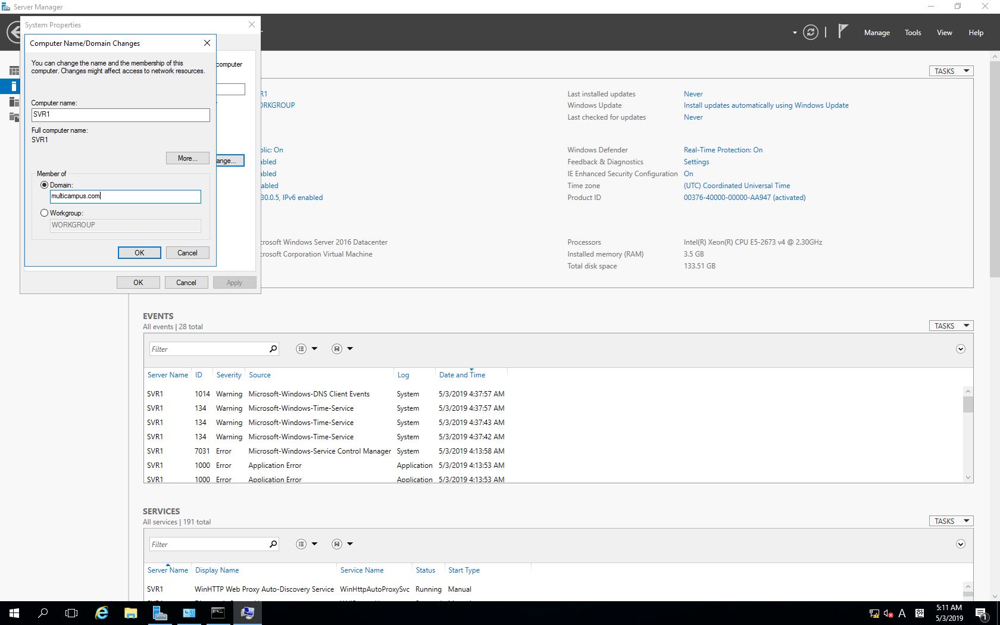
      - svr1을 도메인 환경에 넣어주기 (grouping)
      - 비번 치면 welcome 화면 뜸 (재시작)
      - 
      - user_kim으로 svr에 로그인! (but 나는 svr에 이 계정 만든 적 없다 : DC에서 만든 계정으로 로그온)
      - 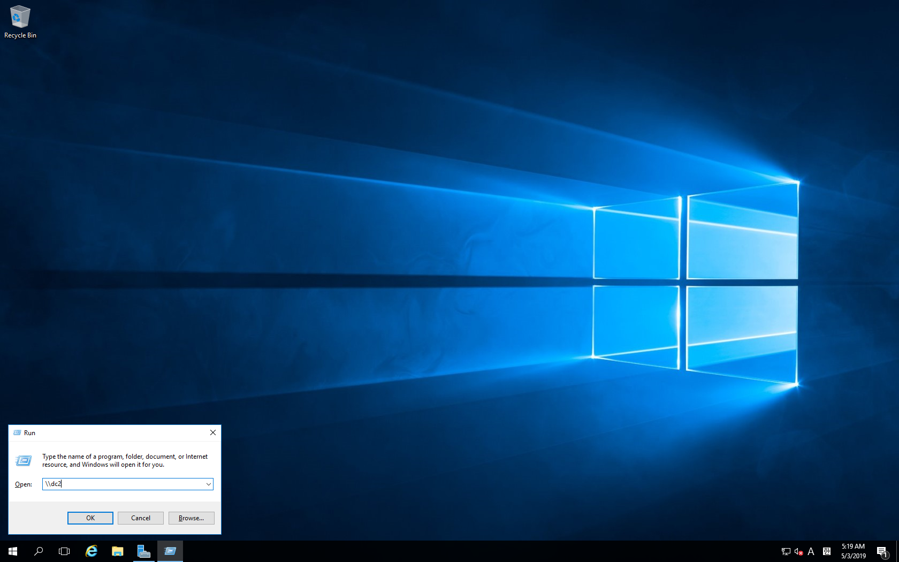
      - 그리고 아까 Domain Admins 설정 해줬기 때문에 dc로 추가 인증 없이 접속 가능
      - 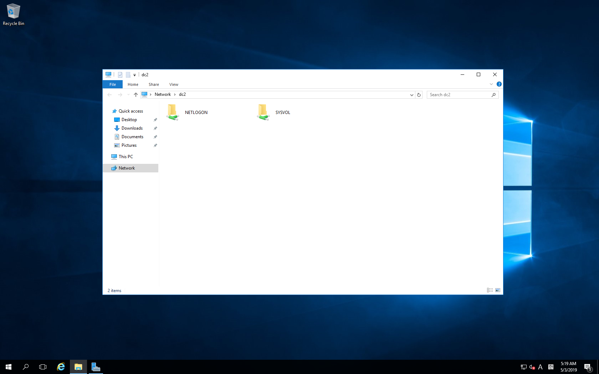
      - 그리고 dc에서 svr로 접근하려면 방화벽을 뚫어야 함
        - svr 컴퓨터에서 firewall.cpl : file & printer sharing 다 열어줘라
      - GPO 만들고 원격 Control 할 것임
        - Dc로 이동 : control panel을 모든 컴퓨터에서 못열도록 설정할 것임
        - 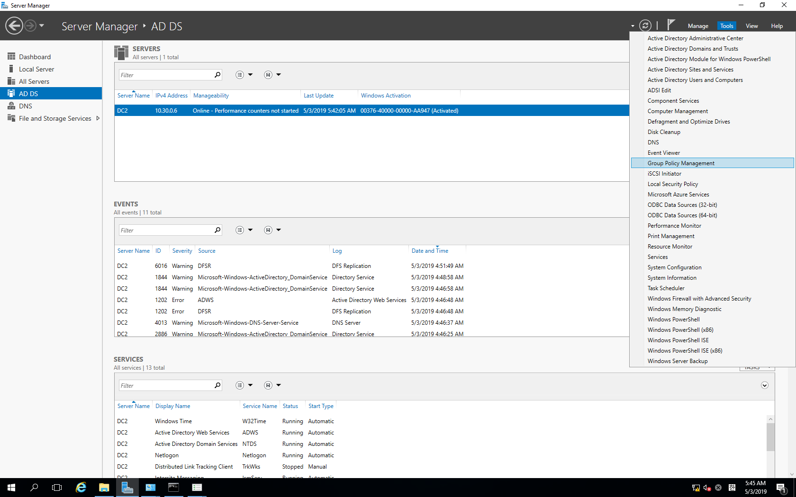
        - Group policy management : 한방에 정책 관리
        - 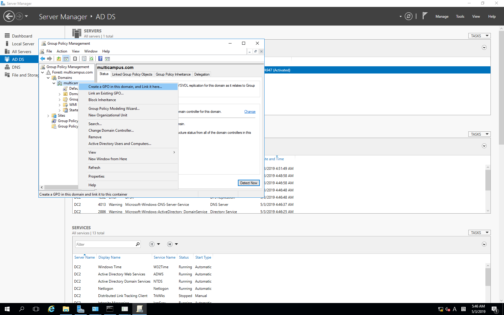
        - 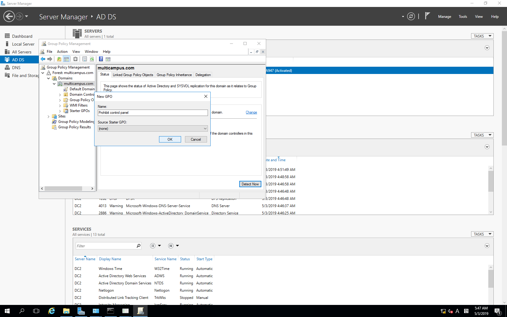
        - 제어판 차단
        - 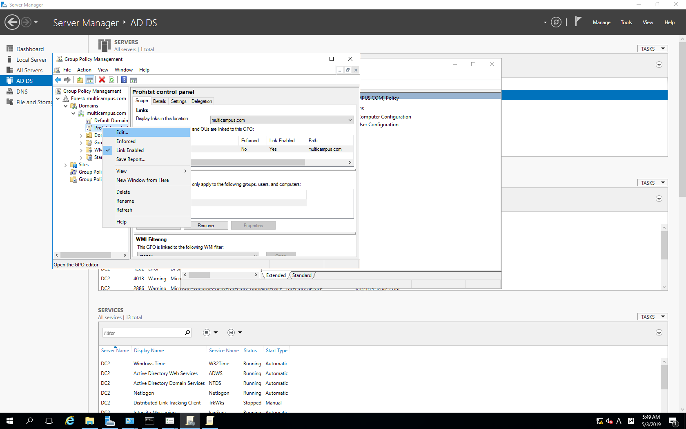
        - 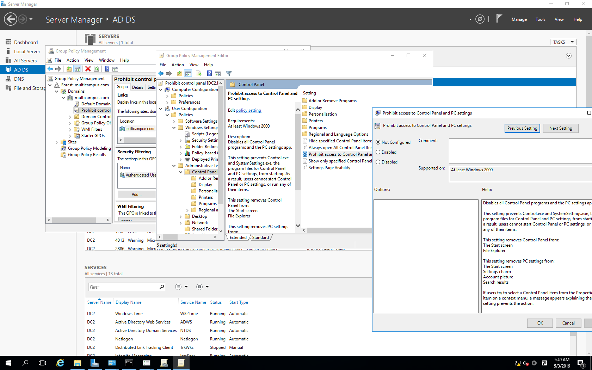
        - 이렇게 따라가서 Enable 해주면 된다
        - 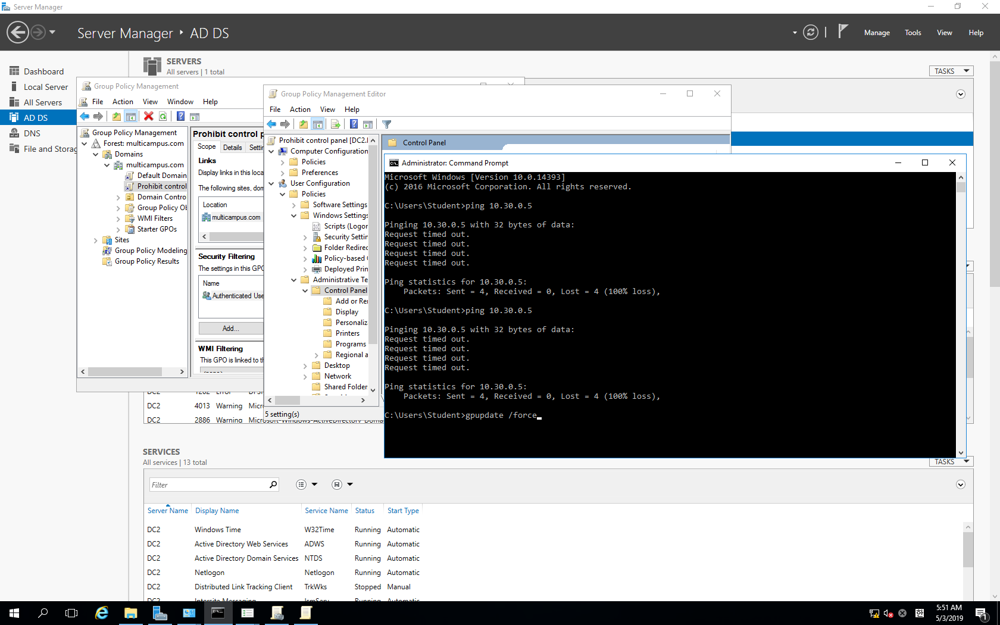
        - 그후 정책 새로고침 (dc / server 둘 다)

- 실습 2 : 10979 AK8

  - 1. Azure Active Directory에서 New User 생성해서 그에 관한 권한 부여하고 권한에 따른 subscription이 주어졌는지 확인

  - 2. 새로운 tenant 만들고

       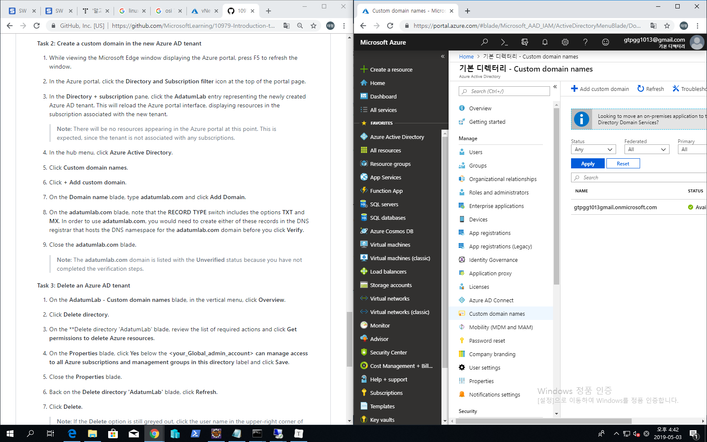

       - custom domain name 설정
       - 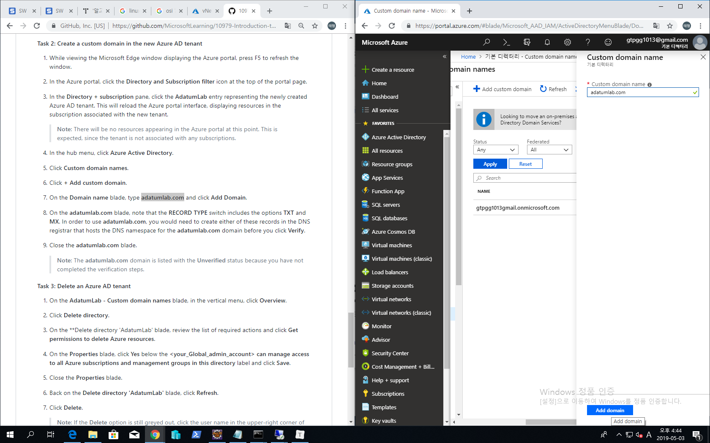

- 명령어 정리

  - linux
    - cat : 열기
    - find : 찾기
    - grep : filtering

- 단어 정리
  
  - RBAC : Role Based Access Control