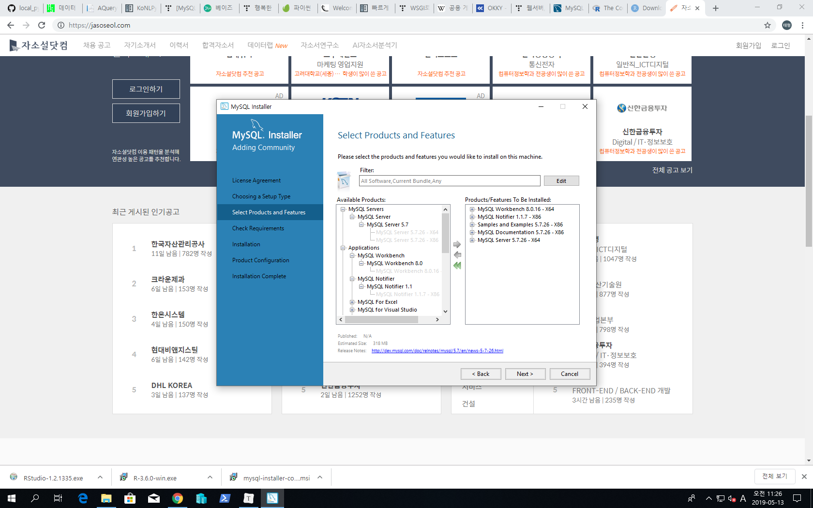

# 2019/05/13

# 딥러닝을 위한 빅데이터 기초 #2

# DB

- 자료의 집합

- table들로 구성됨

- sql : 구조적 질의어 : structed query language

  - 정형 데이터 & 비정형 데이터 : DB에 때려 넣고, 꺼내 쓰는 (이미 만들어진) 언어
  - 막 Oracle 이랑 MS SQL 이랑 서로 다르니까 힘들어~
    - ANSI 표준 SQL(MS 등 다른애들) / Oracle SQL 두 부류로 나뉘어서 표준경쟁 하는 중
  - DB에서 CRUD 작업 : 정보를 create / retreive / update / delete
    - 가장 많이 하는 부분은 retrieve : 검색
      - 검색된 자료들에 대해서 전처리 및 가공 등 부속 작업들을 진행하게 될 것임

  

- 목차 설명

  - T-SQL

  - select query

  - join : 자료들을 합치는 작업 : table을 연결한다

    - inner / outer / cross join

  - sorting / filtering

  - DML

  - built-in functions

  - groupping / aggregating : Excel의 pivot table마냥 data 재구조화

  - subquery

  - procedures : 일종의 function..? 

    

# R 프로그래밍

- rstudio
- MS R client 설치 후 할 수도 있음
- 목차
  - 빅데이터는 무엇인가?
  - 시각화
  - 처리
  - 병렬처리(빠르게!)
  - ML 종류
    - 분류(classification) : 이항분류 / 다항분류
    - 예측(expectation) : regression : 연속형 데이터로 예측값이 나오게 됨
      - linear regression
        - 입력변수 1개 : 단순회귀 / 여러개 : 다항 회귀

- 번외 : 딥러닝 / 인공지능이 필요한 이유?
  - 사람이 편해지기 위함 : 사람이 하는 일을 대신한다!
    - 숫자 / 문자 / 멀티미디어 데이터를 그럼 기계가 알아들을 수 있게 전해줘야 함!
      - data type가 필요한 이유
      - 결국은 모든 데이터를 수치 데이터와 문자 데이터로 변경시켜서 전달해줘야~

# 실습환경 구성

- Mysql : <https://dev.mysql.com/downloads/mysql/>
  - 5.7버전(안정적 버전) 다운
  - custom 선택
  - 
  - vs C++ 설치하고
  - 그리고 TCP/IP 포트 설정까지 진행 : Port는 3306 default로!
  - 쭉쭉하다가 connection 에다가 설정한 비번 1234 확인하믄 댐
- r설치 : www.r-project.org
  - cran 가서 base 받으면 됨
- rstudio 설치 : www.rstudio.com

# 오후수업

- implicit programming (묵시적)

  - 조건을 모두 기술하지 않아도 적절하게 처리 결과를 도출하는 프로그램 - AI

- explicit programming (명시적)

  - 주어진 문제를 해결하기 위한 조건들이 모두 주어지고, 적절하게 처리결과를 도출하는 프로그램

- 드론 택배 시스템

  - 모든 상황의 수를 내가 프로그래밍하여 알고리즘을 만들 수 없다 : AI의 등장 배경
  - 묵시적으로! 조건을 다 안줘도 해결해야 해!

- Big O complexity

- 조건부 확률

  - 일종의 역발상 : 베이즈 이론 : Markov chain
    - spam mail 분류기 (앞으로 만들거임)
    - 대출가능자 분류기
      - 얼마나, 무슨 근거로 대출해 줄 것인가? : 금융공학
    - 성격 분류기
    - 신문 텍스트마이닝 : 영향력 분류...?
      - 형태소 분류 토큰화 하여 분 - 석

- 자연어 처리 챗봇

  - 특정 분야의 챗봇 : 영어가 그나마 나음

- ### 공모전 & IDEA POOL

  - #### 취업 하고싶은 곳과 관련된 분야로 정하는게 좋다

  - 다양한 형태의 output..?

  - Gamer 이탈 issue / 부분유료화 게임 cash 아이템 가격 결정

  - 사실상 의사의 처방이 개인의 질환/상황에 대해 customzing 되지 않았다

    - AI가 추천해준 것에 의사의 insight가 합쳐져서 더 좋은 결과 낳을 수 있지 않을까?

  - 어떤 스타일의 제안서가 reject가 많이 되고 / 반면 어떤거는 accept가 많이 될까?

  - X-ray 사진을 보여주고 어떤 질병일까? 의사한테 물어보면 20% / AI는 35%였다

  - 금융 Trading : 주식 예측 / 환율 예측

  - 필적감정 AI

  - 농림원 API / DB 이용해서 병충해 예측 : + 특정 작물 가격 예측

  - 사진 이용 모델은 사진이 많이 있어야함

  - 조선왕조실록 배경으로 왕이 성향 분석

  - ### 현재 돌아가는 사업 분석

    - E-commerce : 현업 쇼핑몰에 대한 데이터가 있을 때 어느 방향으로 분석을 잡는게 좋을것인가?

  - 공모전 모음 사이트?

    - <http://www.detizen.com/>
    - <https://www.thinkcontest.com/>

- 추가 내용
  - T-SQL (Transaction) : ANSI 표준 SQL + MSSQL 부가기능
  - anaconda : virtual 환경 + jupyter notebook
  - 하둡 : 리눅스에서 병렬 처리 더 잘 돌아간다
- 단축키
  - R
    - ctrl+l : 클리어
- 단어
  - data type
    - 자료형 : 숫자 / 문자 / 날짜
  - Transaction : 하나의 작업 단위
    - ATM기에서 돈을 뽑는다 (1개의 트랜잭션)
      - 그리고 하위에 다양한 부가 작업들이 필요!
      - 만약 출금하시겠습니까? 했는데 아니오! 하면 일련의 과정 한꺼번에 취소
        - DB에서는 이것을 rollback이라고 부름
        - 네! 라고 하면 commit