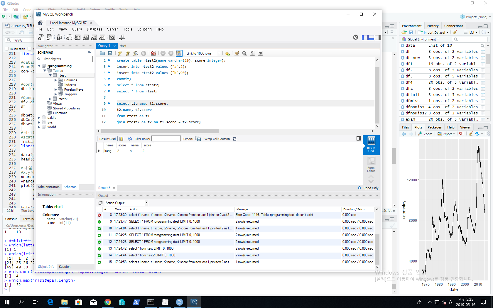
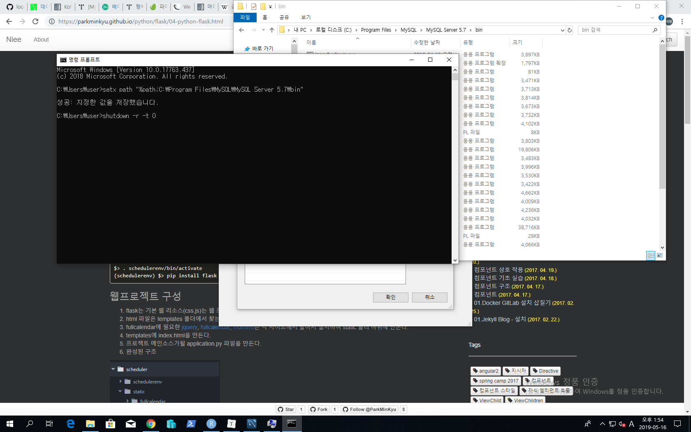
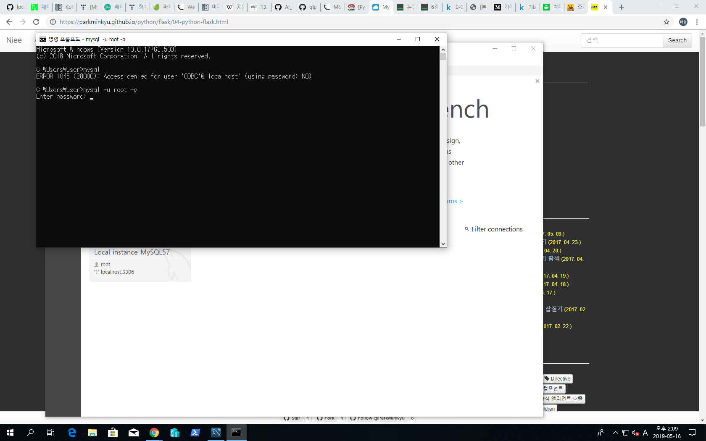
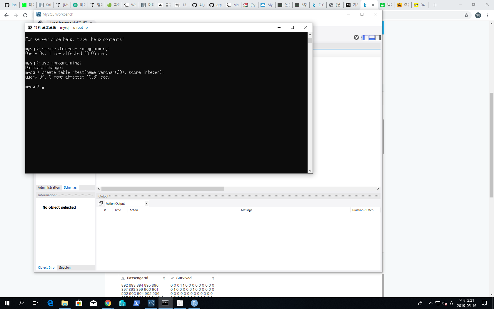
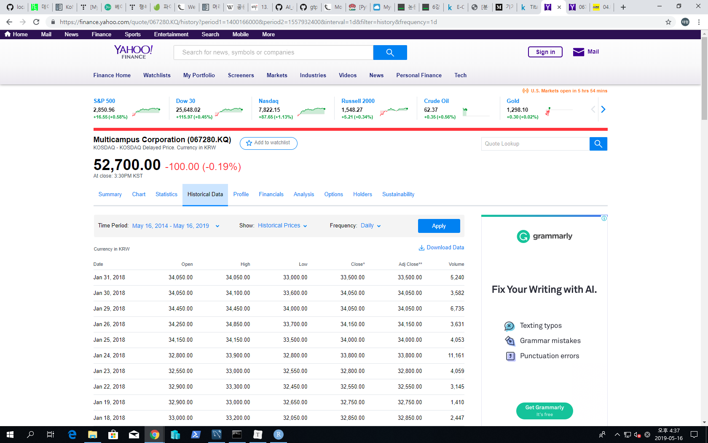

# 2019/05/16

- R 문법수업
  - rbind()
  - cbind()
  - data.frame(x,stringAsFactors=F)
  - apply(x,1 or 2, FUN)
  - rowSums
  - colSums
  - rowMeans
  - colMeans
  - lapply
  - list / unlist
  - sapply : 그냥 벡터
  - tapply : 그룹단위 적용
  - rep() : 반복
  - quantile(iris$Sepal.Length,seq(0,1,0.1))
  - order : index 오름차순 제공
  - orderBy
  - sample : 랜덤추출
  - NROW()
  - NCOL()
  - split(x, colname) : 종별로 나눈 데이터 : list구조
  - subset(x,boolean) : 조건문으로 / 원하는 열들 추출 가능
  - names(x) : col의 이름들
  - iris[,!names(iris) %in% c("Species","Sepal.Length")]
  - merge()  : 겹치는거 병합
  - sort()
  - runif(1) : 범위 안에서 난수 생성
  - df병합방법
    - list에서 df로
      - do.call(rbind,data)
    - ldply 패키지 : 리스트 넣고 df 리턴
      - ldply(data,rbind())
    - rbindlist : 패키지 data.table
      - rbindlist(data)
  - which : 조건에 맞는 index return
    - which.min / which.max : 컬럼주면 최대/최소 인덱스 리턴
  - RMySQL 패키지
    - dbConnect : 커서객체
    - dbListTables : db에서 접근가능한 table 리턴
    - dbGetQuery : 쿼리문 때리면 결과 df로 리턴
    - sql 명령어
      - select <col_name> from [table]
      - insert into [table] values ( ... )
      - update [table] set <col_name> = {expression} where {expression}
      - delete from [table] where {expression}
      - join
        - select t1.name, t1.score,
          t2.name, t2.score
          from rtest as t1
          join rtest2 as t2 on t1.score = t2.score;
        - 
  - mlbench : plot
  - par() 의 파라미터들로 plot에 조건 줌
    - par로 몇개씩 그래프 보이게 할지 결정가능
  - ggplot2
    - 배경 + 그래프 + 세부옵션
    - ggplot(data=mpg, aes(x=drv,y=hwy)) + geom_col() + xlim(0,10) + ylim(0,10)
- 프로젝트 진행과정
  - 요구사항 분석
  - 계획
  - 데이터 수집
    - DB
    - Web
  - 데이터 전처리
    - NA
    - 상관
    - 차원축소(pca,lda,t-sne)
    - 특징선택
    - 표준화 / 정규화 등
  - 데이터분석 : EDA ; 탐색적 분석 방법
    - R : dplyr
    - Python : np / pd / seaborn / matplot : 
  - 모델링 알고리즘 선택
    - ML : kmeans / knn ...
    - DL : RNN CNN ...
  - 모델링
  - 모델
  - validation : 검사 / 검증
    - k-fold validation 등
      - TP / TN / FP / FN ...
  - 성능평가 => 개선
    - 어디로 회귀할지는 상황에 따라 맞게 회귀!
    - 척도 : precision, recall, f-measure, support
- MySQL과 연동
  - DB의 table을 R로 가져와서 dataframe으로 써먹겠다
  - DB : 데이터들의 집합
    - 여러개의 테이블로 존재
  - schemas에서 스키마 만듬(DB 뼈대)
  - 
  - 
  - 이제 됨
  - 
  - 지금까지 cmd에서 환경설정후 mysql 서버와 연결하여 db와 테이블을 만든 것
  
  

- MySQL 쿼리문
  - select
    - select DISTINCT 컬럼네임 from table : 컬럼안의 내용 중복안되게
    - Alias : name As n / name a : 그리고 table 이름도 alias 줘서 select문에서 땡겨올 수 있음
      - table as t -> select t.name from table as t
    - where문은 쓰는 법 알지?
- #yahoo.com에서 finance 들어가기
  - multicampus 검색해서 드가면 시계열데이터(주가) 얻을 수 있음
  - 
  - 이런 데이터를 분석하기 전에는 꼭 시각화를 한번 보고 분석하는게 훨씬 좋다
  - 이때 사용할 ggplot함수

- 해야하는 것 : 시간계산해서 정해보자 : 시간 정해서