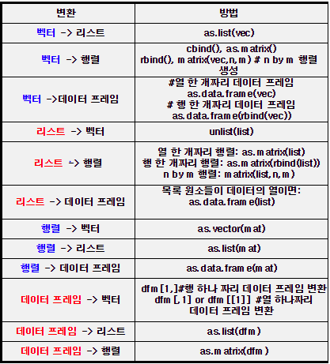

# 2019/05/28

- 
- 감성분석기
- 토픽 모형 : 카테고리 뽑아내기
- 틀에 갖혀있지 말고 다양한 주제들을 다뤄보아라
- 영화 사이트 review에 대한 감성분석
- 신문 기사 감성분석
- 제품 review 감성 분석
- 지식In 등 커뮤니티 사이트
  - 키워드를 입력 : 검색 : 결과에 대해서 scraping
- 재미있을 것 같아서 만들면?
  - 뭐 어쨌든 재미도 중요하지만 "의미 있는 서비스 모델을 만들어야 함"
- 구글 스칼라에
  - afinn : 감성분석사전
  - bing 감성분석사전
  - emolex : 감성분석사전
- 논문 인용횟수 높으면 읽을만한 논문이라 생각하면 되겠군!
- 주제 뭘로할까
  - 내가 관심있는 주제에 대해...?
  - **삼성 갤럭시 전체 주제 vs 아이폰 전체**
    - **<https://www.amazon.com/Samsung-Galaxy-Factory-Unlocked-Phone/product-reviews/B07N4M412B/ref=cm_cr_getr_d_paging_btm_next_3?ie=UTF8&reviewerType=all_reviews&pageNumber=3**>
  - 영화 사이트 review에 대한 감성분석
  - 소설책 / 역사서
  - 성경?!?
  - 신문 기사 감성분석
  - 제품 review 감성 분석
  - 지식In 등 커뮤니티 사이트
    - 키워드를 입력 : 검색 : 결과에 대해서 scraping
  - **www.imdb.com**
  - www.rottentomatoes.com
  - <**https://www.kaggle.com/c/sentiment-analysis-on-movie-reviews/data**>
- 베이지안
- RNN - S2S, W2V
- CNN
- GAN

- XOR NOR OR

- 앞으로의 계획
  - python
    - 선형대수 / 선형방정식 / 선형결합 / 고유값 / 고유벡터
      - 차원축소(PCA,T-SNE)
    - 확률통계 - 분산 / 표준편차 / 이항분포 / 카이제곱
    - 공분산 - 상관분석 / 회귀분석
    - ML(DT,RF(엔트로피),LR,BC,MC,SVM,KNN)
    - 이거 배운 후 kaggle에 제출
    - DL
    - CNN (이미지, 텍스트...)
    - RNN (시계열)
    - GAN
    - RL(Q러닝) / 논문 / 관련연구 / 프로젝트