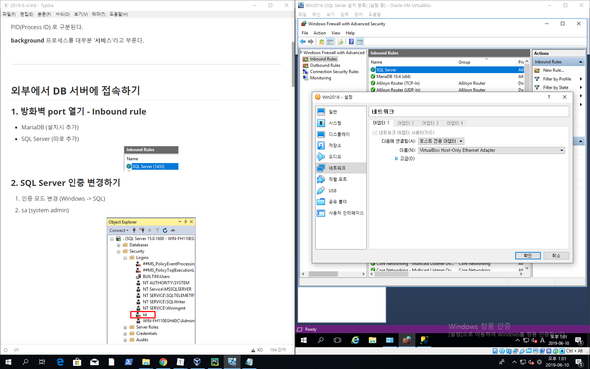

# 2019/06/10

- cafe.naver.com/python5
- 주간 목표
  - python 용 application 만들기
    - computer vision
      - 영상처리 : '빛'에 대한 개념 : low-level이나 하드웨어는 조금 무시하고
  - numpy / pandas / matplotlib + OpenCV
    - numpy애 표준화되어 개발되어가는 라이브러리들
  - 라이브러리 내부 알고리즘의 이해
    - 내 손으로 구현할 수 있어야 함 : 직접구현
  - 구현할 수 있다 : 자신감
  - 목표 : 완전 이해 / 너무 이해 안되면 : 원래 그런가보다! (시간 제약)
  - **파이썬으로 확실히 구현한다**
- 지난 주 복습
  - 컴퓨터 : HW + SW의 전반적 이해 : 대용량 사용하기 때문
  - OS : Unix / Linux / Windows
    - 이 위에 Mysql server / window server 올리고
  - DB : Oracle / Mysql / MariaDB / Sqlite (DBMS)
    - Row, Record / Column, field
  - HeidiSQL?
  - VM : window server 2016 깔고 거기에다 MS sql 올리고 / MariaDB 깔아서 연결해서 로컬에서 사용해보기
- 앞으로
  - GUI
  - 응용 프로그램 제작
  - Oracle VirtualBox?
- Python Tip
  - 변수설정이 코딩의 반
  - 큰따옴표 쓰기


- python 기초 자료구조 / 문법

  - list 이용 : append, pop, pop(0)

  - newlist = mylist랑 newlist = mylist.copy() 다름

    - 주소복사 / 값 복사
    - 근데 보통 copy 잘 안쓰고 newlist = mylist[:] 씀

  - tuple : 읽기 전용 리스트 : ()

  - dictionary : list(myDic.keys()) / list(myDic.values())

  - ```
    tL = sorted(tD.items(), key=operator.itemgetter(1), reverse=True) # sorted 함수에서 key=operator.itemgetter(1) 해주면 1번째 놈을 기준으로 sort하겠다는 뜻
    [('토마스', 17), ('헨리', 8), ('에드워드', 10)]
    [('토마스', 17), ('에드워드', 10), ('헨리', 8)]
    ```

- python은 객체지향을 '지원' 하는 것이기 때문에 함수와 메서드를 같이 씀

  - 함수는 자바에서 (예약된) 전역 메서드 같은 느낌

- 정렬
  - 


- 지난주 메모장

  - ** 2일차 **

    강사PC : \\70.12.113.130

    카페 :  cafe.naver.com/python5

    

    -- 1일차 리뷰 --

    . 컴퓨터 = H/W + S/W

    . H/W = CPU, RAM, Disk(HDD, SSD)

     HDD : 속도 RPM (10000, 7200, 4xxx)

     SSD : M.2, 256GB

    . S/W = OS(Unix, Linux, Windows)

     32bit : x86, i386, i586, x32

     64bit : x64, x86_64, AMD64

    . 가상머신 : Virtual Box -->  Fedora 22 (MySQL 5.7)

       Window Server 2016 (MariaDB 10.4 RC

    ​       SQL Server 2019 CTP)

    

    ** (중요) 외부에서 DB 서버에 접속하기 **

    (1) MariaDB --> root가 외부에서 접속?, 방화벽 등록?

    (2) SQL Server

       . Port 허용 (1433)

       . 인증 모드 변경 (Windows / SQL )

       . sa 사용자 허용

       . TCP(인터넷)를 통해서 접속 허용 (= IP주소로 접속 허용)

    

    

    ** 미션 (2일차) **

    \0. Windows Server 2019 ISO 파일 다운로드

    \0. SQL Server 2017 Express 다운로드 

    \0. MySQL 8.0.x 다운로드

    

    --- 자신이 정리한 내용을 확인하면서 진행 ---

    (1) Virtual Box에 Win2019 설치하고 설정  --> 스냅숏

    (2) Win2019에 SQL 2017, MySQL 8.0을 설치하고 설정 --> 스냅숏

    (3) Win2019에 Python 3.6과 PyCharm 설치후 Hello World 작성 -> 스냅숏

    (4) PC의 HeidiSQL에서 SQL 2017, MySQL 8.0에 접속

    

    캡처 : Pycharm 에서 Hello Wolrd 출력, HediSQL에서 접속된 화면

    강사PC : \\70.12.113.130

    

    제출 : 카페 [미션/과제 제출방]에 다음 제목으로 제출

       [미션 6/4] 빅데이터, 홍*동

- 

- 맨처음 네트워크에서 열어주고

- 

- 그다음에 sa계정 활성화하고(비번:1234)

- 새 계정 생성 : root / 1234

- 그다음 heidi sql 다운받아라